# Hands-On Platform

To start, power up the hardware platform using the dedicated power supply.


# Chapter 1: connecting to the Raspberry Pi

## The Raspberry Pi IP address

The raspberry pi is supposed to have a static IP address of `192.168.1.100/24`.

But, just to make sure, lets use Wireshark to sniff the network and find the IP address of the Raspberry Pi.

<details>
<summary><strong>Here is how</strong></summary>

1. Turn OFF the Raspberry Pi.
2. Install Wireshark on your computer if you don't have it already.
3. Open Wireshark as administrator.
4. Start capturing on the Ethernet interface that is connected to the Raspberry Pi.

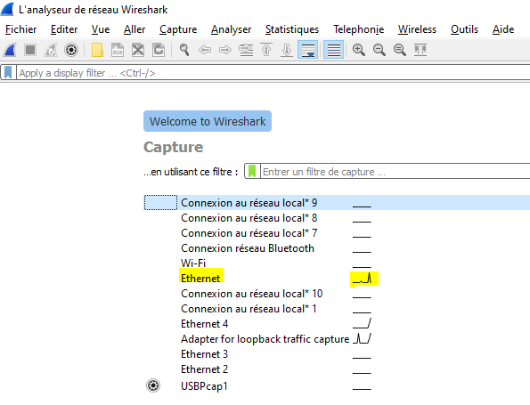

5. Power on the Raspberry Pi.
6. Filter the captured packets with "arp" filter.

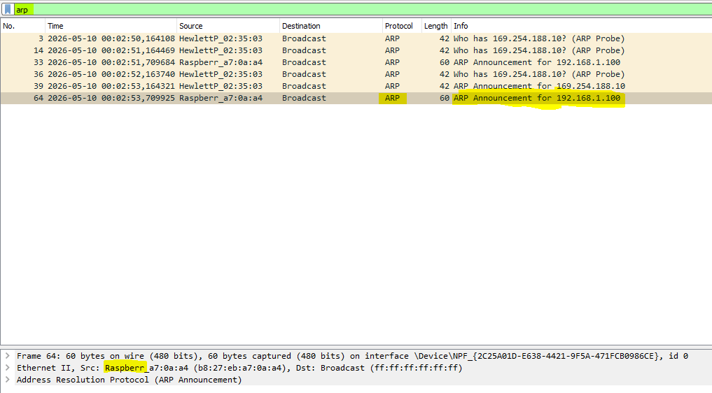

7. You should see an ARP request from the Raspberry Pi like the picture above.

</details>


## Configure your computer to be in the same subnet as the Raspberry Pi

Configure your computer to be in the same subnet as the Raspberry Pi (for example, if the IP address of the Raspberry Pi is `192.168.1.100`):

<details>
<summary><strong>Windows (GUI method)</strong></summary>

1. Open Control Panel → Network and Internet → Network and Sharing Center
2. Click Change adapter settings
3. Right-click your Ethernet adapter → Properties
4. Select Internet Protocol Version 4 (IPv4) → click Properties
5. Choose Use the following IP address
6. Enter:
   - IP address: 192.168.1.20     (use the same xxx.xxx.xxx as the Raspberry Pi and yyy a different number than Raspberry Pi between 2 and 253)
   - Subnet mask: 255.255.255.0
   - Default gateway: (optional, e.g. 192.168.1.1)
   - Click OK

</details>

<details>
<summary><strong>Windows (Command Line)</strong></summary>

1. Open Command Prompt as administrator:

```cmd
netsh interface ip set address name="Ethernet" static 192.168.1.20 255.255.255.0
```

(Replace "Ethernet" with your adapter name if different.)

</details>

<details>
<summary><strong>Linux (temporary setting using ip command)</strong></summary>

Run in terminal:

```bash
sudo ip addr add 192.168.1.20/24 dev eth0
sudo ip link set eth0 up
```

`/24` means that the subnet mask is 255.255.255.0.

Replace `eth0` with your interface (e.g. `enp3s0`, `ens33`)

Check interface names with:

```bash
ip a
```

</details>


## Connect to the Raspberry Pi using SSH

Depending on your operating system, you can use different tools to connect to the Raspberry Pi using SSH:
- On Windows, you can use [PuTTY](https://www.chiark.greenend.org.uk/~sgtatham/putty/latest.html).
- On Mac and Linux, you can use the terminal and the `ssh` command.

for example, if the IP address of the Raspberry Pi is `192.168.1.100`, you can connect to it using the following steps:

<details>
<summary><strong>Windows (using PuTTY)</strong></summary>

1. Open PuTTY.
2. Enter the IP address of the Raspberry Pi in the "Host Name (or IP address)" field.
3. Click "Open" to start the SSH session.

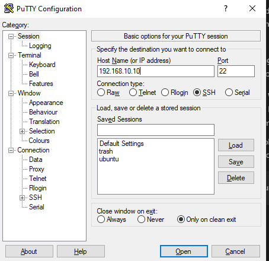

</details>

<details>
<summary><strong>Mac and Linux (using terminal)</strong></summary>

1. Open the terminal.
2. Use the `ssh` command to connect to the Raspberry Pi

```bash
ssh sadaka_jariya@192.168.1.100
```

</details>

In both cases, you will be prompted to enter the username and password for the Raspberry Pi.
You can find these credentials on a sticker attached next to the Raspberry Pi.

## Connect Raspberry Pi to Wi-Fi

Once you are connected to the Raspberry Pi, you can connect it to a Wi-Fi network using the following steps:
1. Open the terminal on the Raspberry Pi.
2. Run this command to open the Wi-Fi configuration file:
```bash
sudo nmcli device wifi connect "Your_SSID" password "Your_Password"
```
Replace "Your_SSID" with the name of your Wi-Fi network and "Your_Password" with the password for your Wi-Fi network.
3. run this command to check if the Raspberry Pi is connected to the Wi-Fi network:
```bash
ip a
```
You should see an IP address assigned to the Wi-Fi interface (usually `wlan0`).

## Overview of the network configuration

So, your PC is connected to the Raspberry Pi via:
- Ethernet cable (for initial setup and maintenance)
- Wi-Fi (for normal operation)

Here is a diagram that shows the network configuration:
- On Raspberry Pi terminal, run "ip a" command to see the IP addresses of the Ethernet and Wi-Fi interfaces.
- On you PC, run "ipconfig" command on Windows or "ip a" command on Linux to see the IP address of your Ethernet interface.

Take your time to understand the network configuration and how the Raspberry Pi is connected to your PC and to the Wi-Fi network.

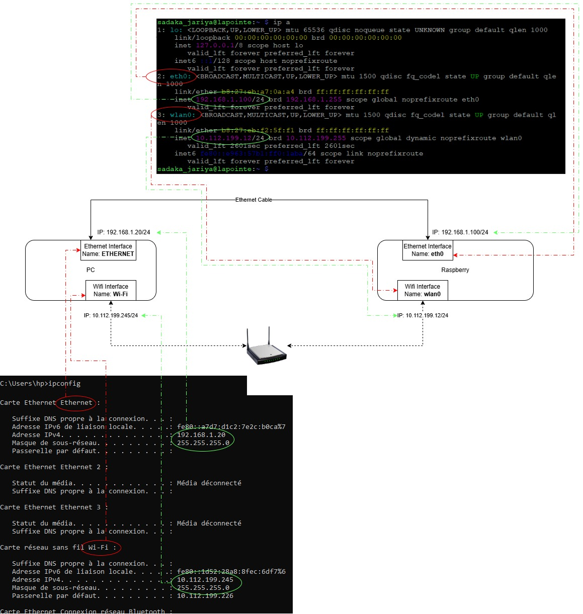

## Connect to the Raspberry Pi using Wi-Fi

Use the Raspberry Pi's Wi-Fi IP address to connect to it using SSH, just like you did with the Ethernet connection. In a whole new terminal / putty.

In the example above, the Wi-Fi IP address of the Raspberry Pi is `10.112.199.12`, so you can connect to it using the following command:

<details>
<summary><strong>Linux</strong></summary>

```bash
ssh sadaka_jariya@10.112.199.12
```
</details>

<details>
<summary><strong>Windows (using PuTTY)</strong></summary>

1. Open PuTTY.
2. Enter "Hostname (or IP address)": `sadaka_jariya@10.112.199.12`
3. Click "Open" to start the SSH session.
</details>

## Unplug the Ethernet cable  !!!!!

To avoid confusing the Linux of the Raspberry Pi, close the SSH window opened using the Ethernet connection (IP 192.168.1.100 in the example), then unplug the Ethernet cable from the Raspberry Pi and make sure that you can still connect to it using Wi-Fi.

<details>
<summary><strong>If you want to keep the Ethernet cable connected</strong></summary>
You can configure the Raspberry Pi to use the Wi-Fi connection as the default route for internet access. This way, the Raspberry Pi will use the Wi-Fi connection for internet access and the Ethernet connection for local network access.

```bash
sudo nmcli device modify eth0 ipv4.route-metric 800
sudo nmcli device modify wlan0 ipv4.route-metric 600
```

Run the following command to check the routing table and make sure that the Wi-Fi connection is the default route:
```bash
ip route
```

You should get something like this:
```bash
sadaka_jariya@lapointe:~ $ ip route
default via 10.112.199.226 dev wlan0 proto dhcp src 10.112.199.12 metric 600
default via 192.168.1.1 dev eth0 proto static metric 800
10.112.199.0/24 dev wlan0 proto kernel scope link src 10.112.199.12 metric 600
192.168.1.0/24 dev eth0 proto kernel scope link src 192.168.1.100 metric 800
```

The route metric represents the priority of the route. The lower the metric, the higher the priority. In this case, the Wi-Fi connection has a lower metric (600) than the Ethernet connection (800), so it will be used as the default route for internet access.
</details>

## Test internet connection

Let's test the internet connection on the Raspberry Pi by pinging a public server. Run the following command:

```bash
ping 8.8.8.8
```

The IP 8.8.8.8 is a public DNS server that is commonly used for testing internet connectivity.

It should return something like this:

```bash
sadaka_jariya@lapointe:~ $ ping 8.8.8.8
PING 8.8.8.8 (8.8.8.8) 56(84) bytes of data.
64 bytes from 8.8.8.8: icmp_seq=1 ttl=117 time=81.2 ms
64 bytes from 8.8.8.8: icmp_seq=2 ttl=117 time=24.1 ms
64 bytes from 8.8.8.8: icmp_seq=3 ttl=117 time=52.1 ms
```

Press Ctrl+C to stop the ping command.

## Next Time You Try To Connect to the Raspberry Pi

Next time you want to connect to the Raspberry Pi, you will have to do the same thing!

Here is a summary of the steps with the debug procedure to confirm that each step has worked:

1. Power off Raspberry Pi
   - Verification that the Raspberry Pi is off: Raspberry Pi red and green LEDs are off.
2. Connect the Ethernet cable between your computer and the Raspberry Pi.
3. Open Wireshark as administrator and start capturing on the Ethernet interface that is connected to the Raspberry Pi.
4. Power on the Raspberry Pi.
   - Verification is getting enough power: You should see the red LED on the Raspberry Pi turn on (should not be blinking)
   - Verification the Raspberry Pi is booting: You should see the green LED on the Raspberry Pi blinking.
   - Verification the Raspberry Pi is connected to the network: You should see an ARP request from the Raspberry Pi in Wireshark.
5. Configure your computer to be in the same subnet as the Raspberry Pi.
   - Verification that your PC can reach the Raspberry Pi via the ethernet network: You should be able to ping the Raspberry Pi from your computer.
6. Connect to the Raspberry Pi using SSH.
   - Verification that you can connect to the Raspberry Pi via SSH: You should be able to log in to the Raspberry Pi and see the command prompt.
7. Connect the Raspberry Pi to Wi-Fi.
   - Verification that the Raspberry Pi is connected to the Wi-Fi network: You should be able to ping the Raspberry Pi from your computer using its Wi-Fi IP address.
8. Connect to the Raspberry Pi via SSH using its Wi-Fi IP address.
   - Verification that you can connect to the Raspberry Pi via SSH using its Wi-Fi IP address: You should be able to log in to the Raspberry Pi and see the command prompt.
9. Unplug the Ethernet cable from the Raspberry Pi.
10. Test the internet connection on the Raspberry Pi.
   - Verification that the Raspberry Pi has internet access: You should be able to ping a public server (e.g. `8.8.8.8`) from the Raspberry Pi and get a response.

## Debugging Universal Strategy

The universal strategy for debugging is to draw the chain of responsibility and check each block and link.

For example, let's draw the chain of responsibility for the Raspberry Pi to connect to the PC:

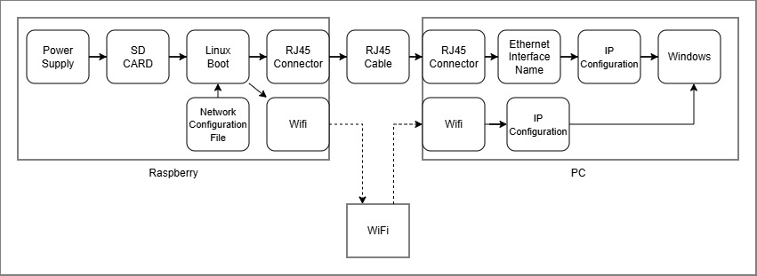

Each block needs to be verified.

Each arrow represents a link that needs to be tested.

**When things don't work, stop, draw the chain, and check each block and link to find the problem.**

## First Linux commands

Update the apt package manager and install some useful tools:

```bash
sudo apt update
sudo apt upgrade
```

Create your own directory and navigate to it:
```bash
mkdir workspace_your_name
cd workspace_your_name
```


## Python Hello World

From your workspace directory, create a simple Python script to print "Hello World" to the console:
```bash
echo 'print("Hello World")' > hello_world.py
```

Then, run the Python script:
```bash
python3 hello_world.py
```

## Blinky

Modern Raspberry Pi OS versions (Debian 12 Bookworm, Debian 13 Trixie, and newer) have moved away from `pigpio` because it is incompatible with newer hardware like the Raspberry Pi 5. Instead, we use `lgpio`, which interacts directly with the standard Linux kernel GPIO interface and works seamlessly across all Raspberry Pi models.

## Step 1: Install the Required Tools

Modern Raspberry Pi OS versions (Debian 12, Debian 13, and newer) use `gpiozero` as the standard, recommended library for controlling hardware components. It is simple, highly readable, and runs safely on top of the modern Linux kernel GPIO interface.

### Step 1: Install the Required Tools

Open your terminal and install `gpiozero` along with its modern backend (`lgpio`):

```bash
sudo apt update
sudo apt install python3-gpiozero python3-lgpio
```

Use nano as text editor to create the script. run this command in the terminal:

```bash
nano blink_leds.py
```

Then, add the following code to the script (copy this script and paste it into the nano editor using right-click or ctrl+shift+v):

```python
from gpiozero import LED
from time import sleep

try:
    # Initialize the LEDs using Physical Header Pin numbers
    green_led  = LED("BOARD29") 
    red_led    = LED("BOARD31")
    yellow_led = LED("BOARD37")

    print("Blinking LEDs... Press Ctrl+C to stop.")
    
    while True:
        # Turn all LEDs ON
        green_led.on()
        red_led.on()
        yellow_led.on()
        sleep(0.5)

        # Turn all LEDs OFF
        green_led.off()
        red_led.off()
        yellow_led.off()
        sleep(0.5)

except KeyboardInterrupt:
    print("\nExiting and cleaning up...")
    # gpiozero automatically turns off the pins safely when the script ends!
```

Save the file and exit nano (Ctrl+S, then Ctrl+X).

Finally, run the script:

```bash
python3 blink_leds.py
```

# Chapter 2: Hands-On STM32 Nucleo

## Step 1: installing the IDE

Download from the [Official Website](https://www.st.com/en/development-tools/stm32cubeide.html#section-get-software-table) the STM32CubeIDE and install it on your computer.

I recommend installing this version of STM32CubeIDE:

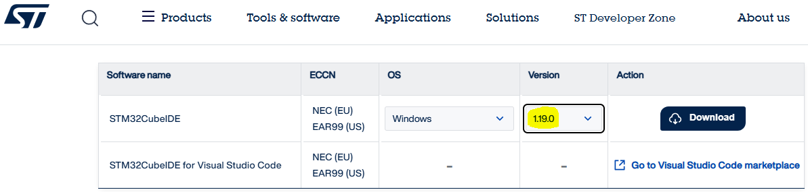

## Step 2: creating the project

Open STM32CubeIDE and create a new STM32 project. 

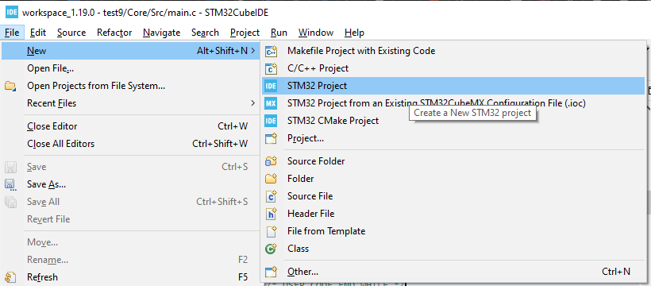

Select the correct board (for example, Nucleo G071RB) and follow the steps to create the project.

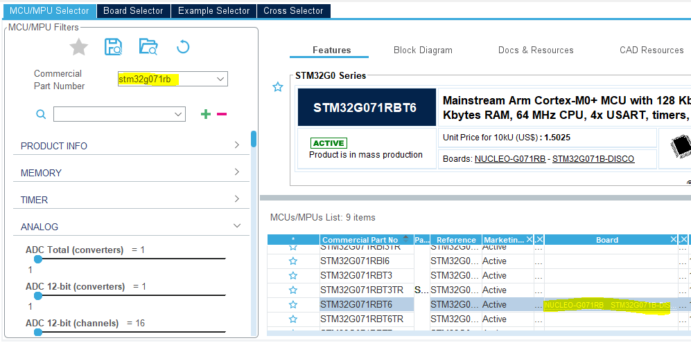

Give a name to your project and click "Finish".

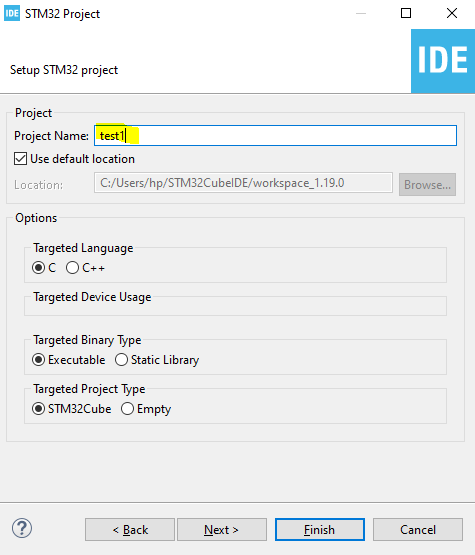

You should now have a new project created in STM32CubeIDE with this workspace structure:

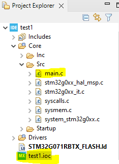

## Step 3: Blinky

Now, let's make the Built In LED of the STM32 Nucleo board blink. To do this, we will use the STM32CubeIDE to configure the GPIO pin connected to the LED and write a simple program to toggle it.

Open the .ioc file and configure the GPIO pin connected to the LED as an output.

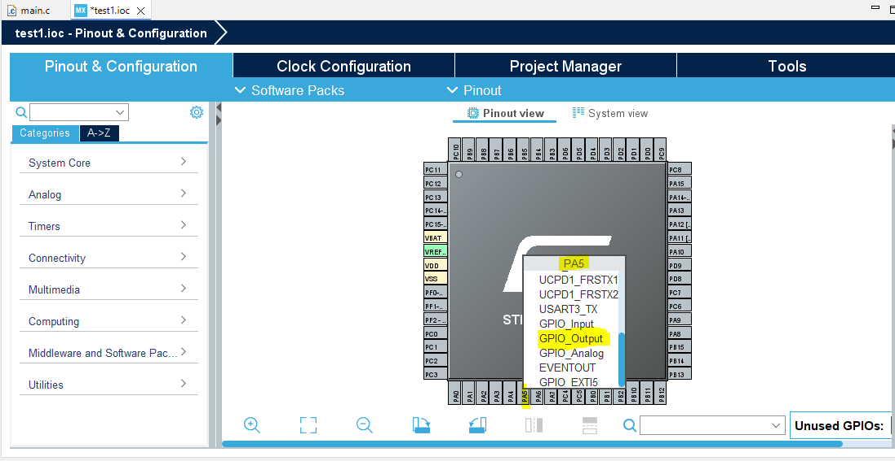

Then, generate the code by clicking on "Project" > "Generate Code" or just ctrl+ S to save and generate the C code.

Take your time to explore the generated code and understand how the GPIO pin is configured and how to toggle it.

Finally, add this code to the while(1) loop in the main.c file to make the LED blink:

```c
  while (1)
  {
    /* USER CODE END WHILE */
	/* Toggle the state of PA5 */
	HAL_GPIO_TogglePin(GPIOA, GPIO_PIN_5);
	/* Insert a delay of 500ms */
	HAL_Delay(500);
    /* USER CODE BEGIN 3 */
  }
```

We need to understand that CubeIDE supports build for "Release" and "Debug" configurations. The "Debug" configuration includes debug symbols and is not optimized, while the "Release" configuration is optimized and does not include debug symbols. For this reason, we will build the project in "Debug" configuration to be able to debug it later.

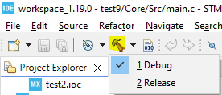

Also, CubeIDE supports building .elf, .hex and .bin files. The .elf file is the one that contains the debug symbols and is used for debugging, while the .hex and .bin files are used for flashing the microcontroller.

To configure the IDE to generate all three files, go to "Project" > "Properties" > "C/C++ Build" > "Settings" > "Tool Settings" > "MCU Post build outputs" and check the boxes for .hex and .bin files **for both Release and Debug** configurations.

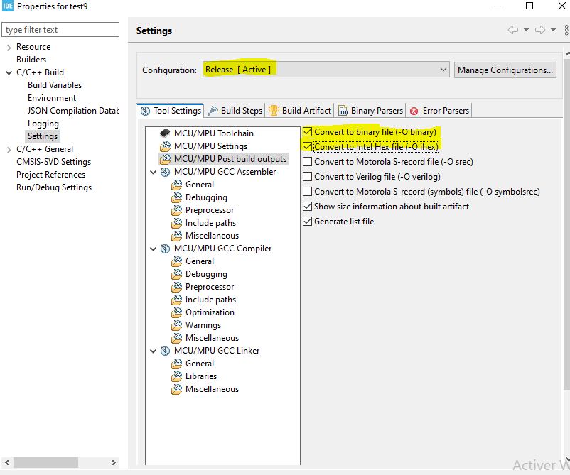

After hitting the build button, you should see in the "Debug" folder of your project the generated .elf, .hex and .bin files.

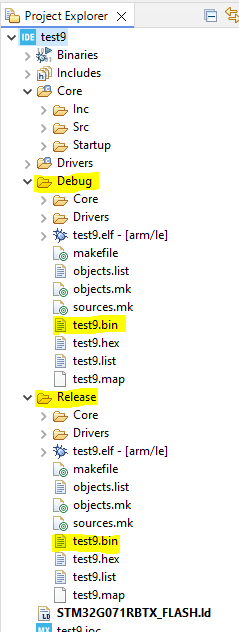

## Step 4: Flashing the Microcontroller

### Flashing with the Raspberry Pi

1. Install the tools:

```Bash
sudo apt update
sudo apt install stlink-tools
```

2. Transfer the .bin file from your computer to the Raspberry Pi using

<details>
<summary><strong>scp command for linux and mac</strong></summary>

```Bash
scp path_to_your_file.bin sadaka_jariya@192.168.1.100:/home/sadaka_jariya/workspace_your_name
```

</details>

<details>
<summary><strong>WinSCP app interface for windows (install it).</strong></summary>

Install it, and transfer the .bin file from your computer to the Raspberry Pi using the app interface. Just enter the IP address of the Raspberry Pi, username and password, and then navigate to the workspace directory and upload the .bin file.

Check Youtube for tutorials on how to use WinSCP to transfer files to a Raspberry Pi.

</details>

3. Flash the file:
Plug in your Nucleo via USB to the Raspberry Pi and run:
```Bash
st-flash write your_file.bin 0x08000000
```

And it should work and the LED should start blinking.

## Exercise

Let's create an auto-test pipeline that test all connections of the STM32 and Raspberry Pi:

Easiest and most important:

- GPIOs from STM32 to Raspberry Pi,
- UART from STM32 to Raspberry Pi,

In second priority:
- I2C from STM32 to ADC,
- SPI from STM32 to FRAM,
- I2C from Raspberry Pi to DAC.

Here is the page for the guided exercise: [Auto-Test](../02_2_auto_test/README.md)
