# Hands-On Platform

To start, power up the hardware platform using the dedicated power supply.


# Chapter 1: connecting to the Raspberry Pi

## The Raspberry Pi IP address

The raspberry pi is supposed to have a static IP address of `192.168.1.100/24`.

But, just to make sure, lets use Wireshark to sniff the network and find the IP address of the Raspberry Pi.

<details>
<summary><strong>Here is how</strong></summary>

1. Turn OFF the Raspberry Pi.
2. Install Wireshark on your computer if you don't have it already.
3. Open Wireshark as administrator.
4. Start capturing on the Ethernet interface that is connected to the Raspberry Pi.

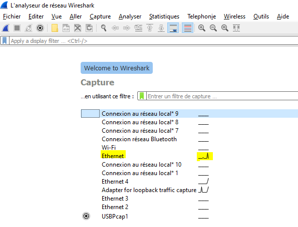

5. Power on the Raspberry Pi.
6. Filter the captured packets with "arp" filter.

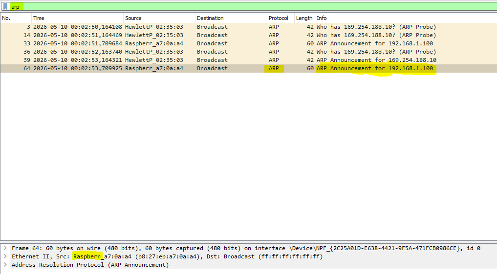

7. You should see an ARP request from the Raspberry Pi like the picture above.

</details>


## Configure your computer to be in the same subnet as the Raspberry Pi

Configure your computer to be in the same subnet as the Raspberry Pi (for example, if the IP address of the Raspberry Pi is `192.168.1.100`):

<details>
<summary><strong>Windows (GUI method)</strong></summary>

1. Open Control Panel → Network and Internet → Network and Sharing Center
2. Click Change adapter settings
3. Right-click your Ethernet adapter → Properties
4. Select Internet Protocol Version 4 (IPv4) → click Properties
5. Choose Use the following IP address
6. Enter:
   - IP address: 192.168.1.20     (use the same xxx.xxx.xxx as the Raspberry Pi and yyy a different number than Raspberry Pi between 2 and 253)
   - Subnet mask: 255.255.255.0
   - Default gateway: (optional, e.g. 192.168.1.1)
   - Click OK

</details>

<details>
<summary><strong>Windows (Command Line)</strong></summary>

1. Open Command Prompt as administrator:

```cmd
netsh interface ip set address name="Ethernet" static 192.168.1.20 255.255.255.0
```

(Replace "Ethernet" with your adapter name if different.)

</details>

<details>
<summary><strong>Linux (temporary setting using ip command)</strong></summary>

Run in terminal:

```bash
sudo ip addr add 192.168.1.20/24 dev eth0
sudo ip link set eth0 up
```

`/24` means that the subnet mask is 255.255.255.0.

Replace `eth0` with your interface (e.g. `enp3s0`, `ens33`)

Check interface names with:

```bash
ip a
```

</details>


## Connect to the Raspberry Pi using SSH

Depending on your operating system, you can use different tools to connect to the Raspberry Pi using SSH:
- On Windows, you can use [PuTTY](https://www.chiark.greenend.org.uk/~sgtatham/putty/latest.html).
- On Mac and Linux, you can use the terminal and the `ssh` command.

for example, if the IP address of the Raspberry Pi is `192.168.1.100`, you can connect to it using the following steps:

<details>
<summary><strong>Windows (using PuTTY)</strong></summary>

1. Open PuTTY.
2. Enter the IP address of the Raspberry Pi in the "Host Name (or IP address)" field.
3. Click "Open" to start the SSH session.

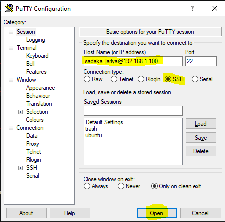

</details>

<details>
<summary><strong>Mac and Linux (using terminal)</strong></summary>

1. Open the terminal.
2. Use the `ssh` command to connect to the Raspberry Pi

```bash
ssh sadaka_jariya@192.168.1.100
```

</details>

In both cases, you will be prompted to enter the username and password for the Raspberry Pi.
You can find these credentials on a sticker attached next to the Raspberry Pi.

## Connect Raspberry Pi to Wi-Fi

Once you are connected to the Raspberry Pi, you can connect it to a Wi-Fi network using the following steps:
1. Open the terminal on the Raspberry Pi.
2. Run this command to open the Wi-Fi configuration file:
```bash
sudo nmcli device wifi connect "Your_SSID" password "Your_Password"
```
Replace "Your_SSID" with the name of your Wi-Fi network and "Your_Password" with the password for your Wi-Fi network.
3. run this command to check if the Raspberry Pi is connected to the Wi-Fi network:
```bash
ip a
```
You should see an IP address assigned to the Wi-Fi interface (usually `wlan0`).

## Connect to the Raspberry Pi using Wi-Fi

Use the Raspberry Pi's Wi-Fi IP address to connect to it using SSH, just like you did with the Ethernet connection. In a whole new terminal / putty.

Once you connected to the Raspberry Pi using Wi-Fi, you can disconnect the Ethernet cable and continue working with the Raspberry Pi over Wi-Fi.


## First Linux commands

Update the apt package manager and install some useful tools:

```bash
sudo apt update
sudo apt upgrade
```

Create your own directory and navigate to it:
```bash
mkdir workspace_your_name
cd workspace_your_name
```


## Python Hello World

From your workspace directory, create a simple Python script to print "Hello World" to the console:
```bash
echo 'print("Hello World")' > hello_world.py
```

Then, run the Python script:
```bash
python3 hello_world.py
```

## Blinky

Now, let's make the three LEDs connected to the raspberry pi blink. To do this, we will use the gpiod library.

Setting up pigpio is a smart move. While the standard RPi.GPIO library is fine for basic tasks, pigpio is the "gold standard" for precision. It uses DMA (Direct Memory Access) to handle timing, which means you get hardware-accurate PWM and way less jitter when controlling servos or reading high-speed sensors.

Since you're using a Raspberry Pi Model B (the classic 26-pin version), pigpio works perfectly, though you'll have fewer pins to play with than the modern 40-pin models.

Most modern Raspberry Pi OS versions include pigpio by default, but it's always good to ensure you have the latest version and the Python headers.

Open your terminal and run:

```Bash
which pigpiod
```
If it returns a path, pigpio is installed. If not, you can install it with:

```Bash
sudo apt update
sudo apt install pigpio python3-pigpio
```

Now, you can start the pigpio daemon, which is necessary for the library to work:

```Bash
sudo pigpiod
```

To make it start automatically every time the Pi boots:

```Bash
sudo systemctl enable pigpiod
sudo systemctl start pigpiod
```

Now, you can create a Python script to blink the LEDs. Here's an example script that blinks the three LEDs connected to GPIO pins X, Y, and Z (replace these with the actual GPIO pin numbers, visually identify the pins connected to the LEDs on your Raspberry Pi, for example, GPIO 29, GPIO 31, and GPIO 37):

Use nano as text editor to create the script. run this command in the terminal:

```bash
nano blink_leds.py
```

Then, add the following code to the script (copy this script and paste it into the nano editor using right-click or ctrl+shift+v):

```python
import time
import pigpio

# Connect to the local raspberry pi
pi = pigpio.pi()

if not pi.connected:
    print("Failed to connect to pigpio daemon. Make sure pigpiod is running.")
    exit()

# Define the pin (using BCM numbering)
GREEN_LED_PIN = 29
RED_LED_PIN = 31
YELLOW_LED_PIN = 37

# Set pin mode to output
pi.set_mode(GREEN_LED_PIN, pigpio.OUTPUT)
pi.set_mode(RED_LED_PIN, pigpio.OUTPUT)
pi.set_mode(YELLOW_LED_PIN, pigpio.OUTPUT)

try:
    print("Blinking LED... Press Ctrl+C to stop.")
    while True:
        pi.write(GREEN_LED_PIN, 1) # ON
        pi.write(RED_LED_PIN, 1) # ON
        pi.write(YELLOW_LED_PIN, 1) # ON
        time.sleep(0.5)
        pi.write(GREEN_LED_PIN, 0) # OFF
        pi.write(RED_LED_PIN, 0) # OFF
        pi.write(YELLOW_LED_PIN, 0) # OFF
        time.sleep(0.5)

except KeyboardInterrupt:
    print("\nCleaning up...")
    pi.write(GREEN_LED_PIN, 0) # Turn off LED
    pi.write(RED_LED_PIN, 0) # Turn off LED
    pi.write(YELLOW_LED_PIN, 0) # Turn off LED
    pi.stop()            # Disconnect from the daemon
```

Save the file and exit nano (Ctrl+S, then Ctrl+X).

Finally, run the script:

```bash
python3 blink_leds.py
```

# Chapter 2: Hands-On STM32 Nucleo

## Step 1: installing the IDE

Download from the [Official Website](https://www.st.com/en/development-tools/stm32cubeide.html#section-get-software-table) the STM32CubeIDE and install it on your computer.

I recommend installing this version of STM32CubeIDE:

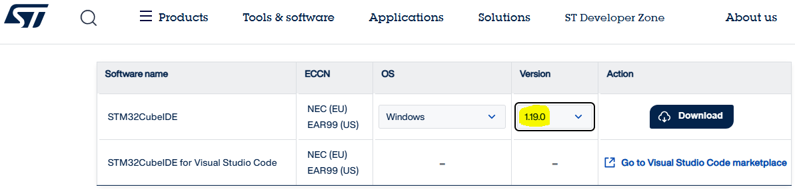

## Step 2: creating the project

Open STM32CubeIDE and create a new STM32 project. 

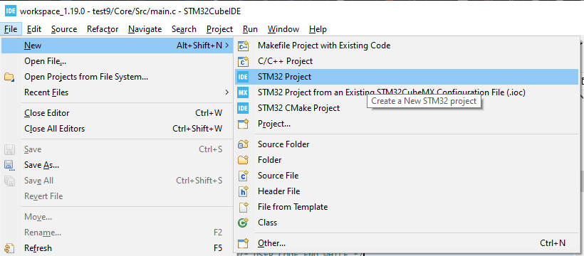

Select the correct board (for example, Nucleo G071RB) and follow the steps to create the project.

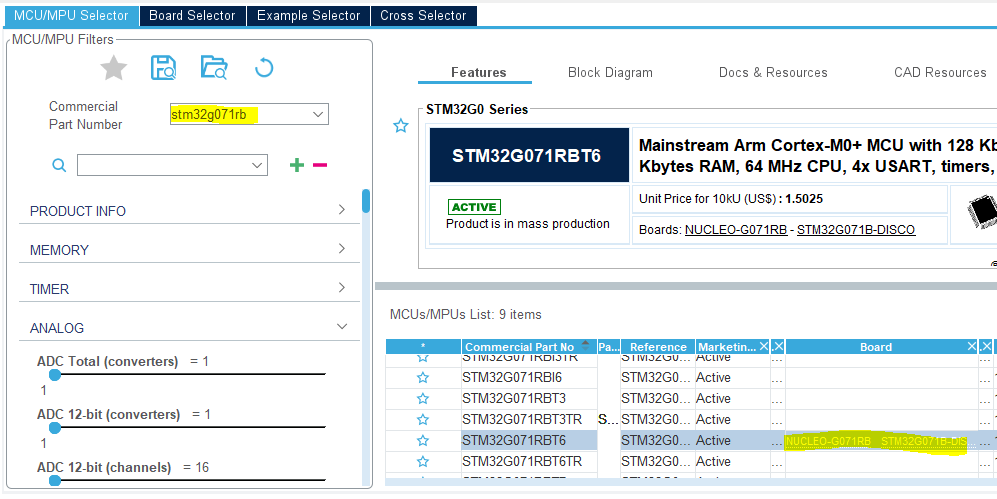

Give a name to your project and click "Finish".

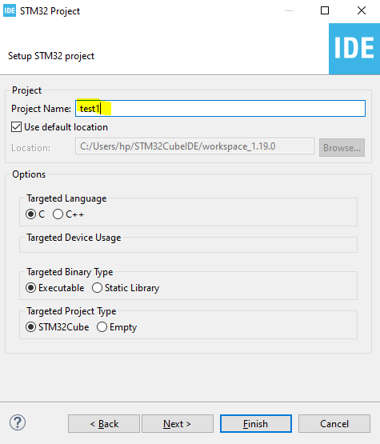

You should now have a new project created in STM32CubeIDE with this workspace structure:

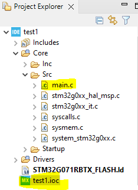

## Step 3: Blinky

Now, let's make the Built In LED of the STM32 Nucleo board blink. To do this, we will use the STM32CubeIDE to configure the GPIO pin connected to the LED and write a simple program to toggle it.

Open the .ioc file and configure the GPIO pin connected to the LED as an output.

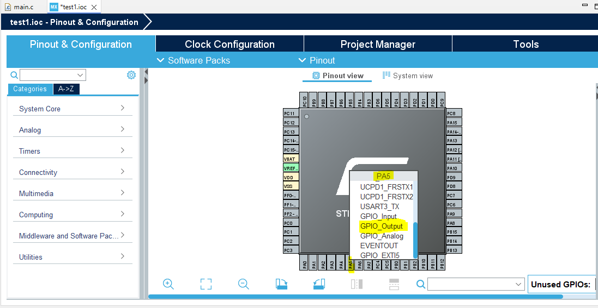

Then, generate the code by clicking on "Project" > "Generate Code" or just ctrl+ S to save and generate the C code.

Take your time to explore the generated code and understand how the GPIO pin is configured and how to toggle it.

Finally, add this code to the while(1) loop in the main.c file to make the LED blink:

```c
  while (1)
  {
    /* USER CODE END WHILE */
	/* Toggle the state of PA5 */
	HAL_GPIO_TogglePin(GPIOA, GPIO_PIN_5);
	/* Insert a delay of 500ms */
	HAL_Delay(500);
    /* USER CODE BEGIN 3 */
  }
```

We need to understand that CubeIDE supports build for "Release" and "Debug" configurations. The "Debug" configuration includes debug symbols and is not optimized, while the "Release" configuration is optimized and does not include debug symbols. For this reason, we will build the project in "Debug" configuration to be able to debug it later.

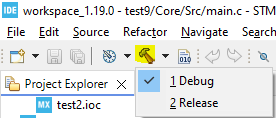

Also, CubeIDE supports building .elf, .hex and .bin files. The .elf file is the one that contains the debug symbols and is used for debugging, while the .hex and .bin files are used for flashing the microcontroller.

To configure the IDE to generate all three files, go to "Project" > "Properties" > "C/C++ Build" > "Settings" > "Tool Settings" > "MCU Post build outputs" and check the boxes for .hex and .bin files **for both Release and Debug** configurations.

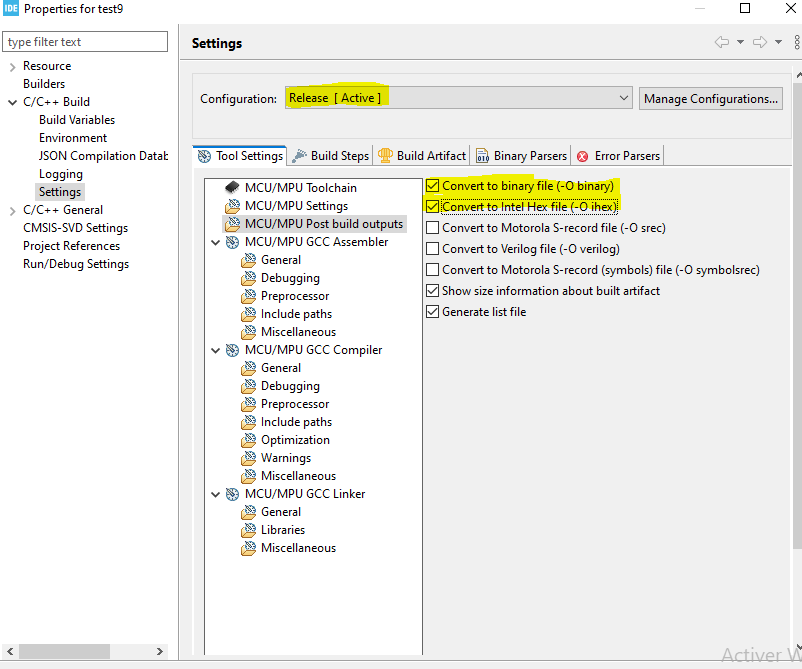

After hitting the build button, you should see in the "Debug" folder of your project the generated .elf, .hex and .bin files.

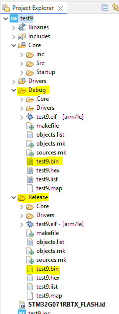

## Step 4: Flashing the Microcontroller

### Flashing with the Raspberry Pi

1. Install the tools:

```Bash
sudo apt update
sudo apt install stlink-tools
```

2. Transfer the .bin file from your computer to the Raspberry Pi using

<details>
<summary><strong>scp command for linux and mac</strong></summary>

```Bash
scp path_to_your_file.bin sadaka_jariya@192.168.1.100:/home/sadaka_jariya/workspace_your_name
```

</details>

<details>
<summary><strong>WinSCP app interface for windows (install it).</strong></summary>

Install it, and transfer the .bin file from your computer to the Raspberry Pi using the app interface. Just enter the IP address of the Raspberry Pi, username and password, and then navigate to the workspace directory and upload the .bin file.

Check Youtube for tutorials on how to use WinSCP to transfer files to a Raspberry Pi.

</details>

3. Flash the file:
Plug in your Nucleo via USB to the Raspberry Pi and run:
```Bash
st-flash write your_file.bin 0x08000000
```

And it should work and the LED should start blinking.

## Exercise

You can have fun exploring the platform and trying to do more complex things with it, things that will be needed later in the guided projects. For example, you can try to:
- Configure two GPIO pins between the Raspberry Pi and the STM32 Nucleo board and control their state from the Raspberry Pi to the STM32 Nucleo board and the other way around.
  - Raspberry Pi --> Nucleo
  - Nucleo --> Raspberry Pi
- Configure the UART peripheral of the STM32 Nucleo board and send data from the Raspberry Pi to the STM32 Nucleo board using UART communication.
