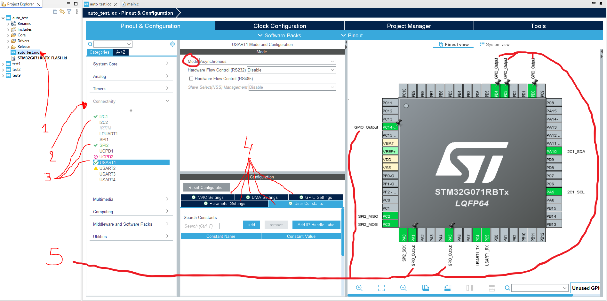

# Auto Test

To do this auto test, we need to write C code for STM32 and a Python script for the Raspberry Pi.

## C Code for STM32

Let's create a new STM32 project and configure these pins:

1. Open the .ioc file,
2. Go to connectivity,
3. For each interface shown in green, enable the interface via the mode dropdown menu:
    - UART1: Asynchronous
    - I2C1: I2C
    - SPI1: Full-Duplex Master
4. Go through the configuration panels, discover the parameters for each interface,
5. Set the GPIOs to GPIO_OUTPUT,
6. Save with ctrl+s to generate the code.





In the main.c file, the idea is to test each group of interfaces (GPIOs, UART, I2C, SPI) one by one. 

For each interface, we will send a message and wait for a response. If the response is correct, else, there maybe a problem:

- Either the interface is broken, grilled,
- Or the cable is not connected properly,
- Or the cable is connected on the wrong pin,
- Or the auto test script is not working properly.

```C
int main(void)
{

  /* USER CODE BEGIN 1 */

  /* USER CODE END 1 */

  /* MCU Configuration--------------------------------------------------------*/

  /* Reset of all peripherals, Initializes the Flash interface and the Systick. */
  HAL_Init();

  /* USER CODE BEGIN Init */

  /* USER CODE END Init */

  /* Configure the system clock */
  SystemClock_Config();

  /* USER CODE BEGIN SysInit */

  /* USER CODE END SysInit */

  /* Initialize all configured peripherals */
  MX_GPIO_Init();
  MX_I2C1_Init();
  MX_SPI2_Init();
  MX_USART1_UART_Init();
  /* USER CODE BEGIN 2 */

  /* ----------- TEST GPIO ----------- */
  // Set up all GPIOs to low
  HAL_GPIO_WritePin(GPIOD, GPIO_PIN_0, GPIO_PIN_RESET);
  HAL_GPIO_WritePin(GPIOD, GPIO_PIN_3, GPIO_PIN_RESET);
  HAL_GPIO_WritePin(GPIOD, GPIO_PIN_4, GPIO_PIN_RESET);
  HAL_GPIO_WritePin(GPIOC, GPIO_PIN_14, GPIO_PIN_RESET);

  // Test Each GPIO one by one
  HAL_GPIO_WritePin(GPIOD, GPIO_PIN_0, GPIO_PIN_SET);
  HAL_Delay(2000);

  HAL_GPIO_WritePin(GPIOD, GPIO_PIN_0, GPIO_PIN_RESET);
  HAL_GPIO_WritePin(GPIOD, GPIO_PIN_3, GPIO_PIN_SET);
  HAL_Delay(2000);

  HAL_GPIO_WritePin(GPIOD, GPIO_PIN_3, GPIO_PIN_RESET);
  HAL_GPIO_WritePin(GPIOD, GPIO_PIN_4, GPIO_PIN_SET);
  HAL_Delay(2000);

  HAL_GPIO_WritePin(GPIOD, GPIO_PIN_4, GPIO_PIN_RESET);
  HAL_GPIO_WritePin(GPIOC, GPIO_PIN_14, GPIO_PIN_SET);
  HAL_Delay(2000);

  HAL_GPIO_WritePin(GPIOC, GPIO_PIN_14, GPIO_PIN_RESET);
  /* ----------- TEST GPIO END ---------- */


  /* ----------- TEST USART ---------- */
	uint8_t rxBuffer[RX_BUFFER_SIZE]; // The buffer to store incoming data
	uint16_t bytesReceived = 0;       // This will track exactly how many bytes we got

	// Clear out the buffer before receiving new data
    memset(rxBuffer, 0, RX_BUFFER_SIZE);
    bytesReceived = 0;

    /* * 3. Call the Receive To Idle function
     * Arguments:
     * &huart1       -> Pointer to your UART configuration handle
     * rxBuffer      -> Where to store the incoming bytes
     * RX_BUFFER_SIZE-> The absolute maximum bytes we are willing to take
     * &bytesReceived-> Variable that the function updates with the actual count
     * 2000          -> Timeout in milliseconds (2 seconds)
     */
    HAL_StatusTypeDef status = HAL_UARTEx_ReceiveToIdle(&huart1, rxBuffer, RX_BUFFER_SIZE, &bytesReceived, 2000);
    if (status == HAL_OK && bytesReceived > 0)
        {
            // Transmit back exactly what we received
            // We use a 500ms timeout for the transmission
            HAL_UART_Transmit(&huart1, rxBuffer, bytesReceived, 500);
        }
        // Optional: handle what happens if it hits the 2-second timeout without any data
        else if (status == HAL_TIMEOUT)
        {
            // 2 seconds passed, no data came in or the packet was incomplete
        	char errorBuffer[64];

			/* Format the error message.
			 * Note: HAL Status values are:
			 * 0 = HAL_OK, 1 = HAL_ERROR, 2 = HAL_BUSY, 3 = HAL_TIMEOUT
			 */
			int msgLength = sprintf(errorBuffer, "\r\n[FAIL] HAL_Status: %d, BytesRx: %d\r\n", status, bytesReceived);

			// Send the error message back over UART
			HAL_UART_Transmit(&huart1, (uint8_t*)errorBuffer, msgLength, 500);
        }
    /* ----------- TEST USART END ---------- */


  /* USER CODE END 2 */

  /* Infinite loop */
  /* USER CODE BEGIN WHILE */
  while (1)
  {
    /* USER CODE END WHILE */
	/* Toggle the state of PA5 */
	HAL_GPIO_TogglePin(GPIOA, GPIO_PIN_5);
	/* Insert a delay of 500ms */
	HAL_Delay(500);
    /* USER CODE BEGIN 3 */
  }
  /* USER CODE END 3 */
}
```


# Python Script for Raspberry Pi

For this python script, we will:

- Flash the STM32 with the binary of code above, this will ensure synchronization between the STM32 and the Raspberry Pi,
- Read GPIOs as input, it should follow the same sequence as the STM32 code, and print "PASS" or "FAIL" for each GPIO test,
- then send a message to the STM32 via UART, and wait for a response. If the response is correct, we will print "PASS", else we will print "FAIL".

To be able to use the UART on the Raspberry Pi, we need to enable it first.

1. Enable UART & Disable Serial Console/
    - Since you are running OS Lite, you will do this via the terminal or raspi-config.
    - Run the configuration tool: ```sudo raspi-config```
    - Navigate to: 3 Interface Options -> I6 Serial Port.
    - It will ask two critical questions:
      - Would you like a login shell to be accessible over serial? Select No.
      - Would you like the serial port hardware to be enabled? Select Yes.

    - Select Finish and choose Yes to reboot the Raspberry Pi.

2. Install pyserial
    - Run the following command to install pyserial: ```sudo pip3 install pyserial```

Now, let's create out ```auto_test.py``` script:

```python
import serial
import time
import sys
import os
import subprocess
from gpiozero import DigitalInputDevice, LED
from typing import List, Tuple


class STM32AutoTest:
    """
    Automated testing suite for STM32 and Raspberry Pi connectivity.
    Tests GPIO, UART, I2C, and SPI interfaces.
    """
    
    def __init__(self, binary_path: str = None, uart_port: str = "/dev/ttyAMA0", 
                 uart_baudrate: int = 115200):
        """
        Initialize the AutoTest class.
        
        Args:
            binary_path: Path to the STM32 compiled binary (.bin file)
            uart_port: UART port on Raspberry Pi (default: /dev/ttyAMA0 for hardware UART)
            uart_baudrate: UART baudrate (default: 115200)
        """
        self.binary_path = binary_path
        self.uart_port = uart_port
        self.uart_baudrate = uart_baudrate
        self.uart = None
        
        # GPIO mapping: STM32 pin name -> RPi BOARD pin number
        # To be configured by user using set_gpio_mapping()
        self.stm32_to_rpi_gpio = {
            'PD0': None,   # STM32 PD0 -> RPi GPIO pin
            'PD3': None,   # STM32 PD3 -> RPi GPIO pin
            'PD4': None,   # STM32 PD4 -> RPi GPIO pin
            'PC14': None,  # STM32 PC14 -> RPi GPIO pin
        }
        
        self.gpio_inputs = {}  # Will store DigitalInputDevice objects
        self.test_results = {}
        
        print("[INFO] STM32 AutoTest initialized")
        print(f"[INFO] UART Port: {self.uart_port} @ {self.uart_baudrate} baud")
    
    def set_gpio_mapping(self, stm32_to_rpi: dict):
        """
        Set the mapping between STM32 GPIO pins and Raspberry Pi GPIO pins.
        
        Args:
            stm32_to_rpi: Dictionary mapping STM32 pins to RPi BOARD pins
                         Example: {'PD0': 12, 'PD3': 16, 'PD4': 18, 'PC14': 22}
        """
        self.stm32_to_rpi_gpio.update(stm32_to_rpi)
        print(f"[INFO] GPIO mapping configured:")
        for stm32_pin, rpi_pin in self.stm32_to_rpi_gpio.items():
            if rpi_pin:
                print(f"       STM32 {stm32_pin} -> RPi BOARD{rpi_pin}")
    
    def flash_stm32(self) -> bool:
        """
        Flash the STM32 microcontroller with the compiled binary.
        
        Returns:
            True if flashing successful, False otherwise
        """
        print("\n" + "="*60)
        print("STEP 1: Flashing STM32")
        print("="*60)
        
        if not self.binary_path:
            print("[ERROR] Binary path not specified. Use set_binary_path() first.")
            return False
        
        if not os.path.exists(self.binary_path):
            print(f"[ERROR] Binary file not found: {self.binary_path}")
            return False
        
        try:
            print(f"[INFO] Flashing binary: {self.binary_path}")
            # Flash to STM32 memory address 0x08000000 (standard ARM Cortex-M flash address)
            result = subprocess.run(
                ['st-flash', 'write', self.binary_path, '0x08000000'],
                capture_output=True,
                text=True,
                timeout=30
            )
            
            if result.returncode == 0:
                print("[PASS] STM32 flashed successfully")
                time.sleep(1)  # Give STM32 time to restart
                self.test_results['flash'] = 'PASS'
                return True
            else:
                print(f"[FAIL] Flashing failed: {result.stderr}")
                self.test_results['flash'] = 'FAIL'
                return False
        
        except FileNotFoundError:
            print("[ERROR] st-flash not found. Install stlink-tools: sudo apt install stlink-tools")
            self.test_results['flash'] = 'ERROR'
            return False
        except Exception as e:
            print(f"[ERROR] Flashing exception: {str(e)}")
            self.test_results['flash'] = 'ERROR'
            return False
    
    def initialize_gpio(self) -> bool:
        """
        Initialize GPIO input devices for reading STM32 outputs.
        
        Returns:
            True if initialization successful, False otherwise
        """
        print("\n" + "="*60)
        print("STEP 2: Initializing GPIO Inputs")
        print("="*60)
        
        if any(pin is None for pin in self.stm32_to_rpi_gpio.values()):
            print("[ERROR] GPIO mapping not configured. Use set_gpio_mapping() first.")
            return False
        
        try:
            for stm32_pin, rpi_pin in self.stm32_to_rpi_gpio.items():
                self.gpio_inputs[stm32_pin] = DigitalInputDevice(f"BOARD{rpi_pin}")
                print(f"[INFO] Initialized STM32 {stm32_pin} on RPi BOARD{rpi_pin}")
            
            print("[PASS] GPIO inputs initialized")
            self.test_results['gpio_init'] = 'PASS'
            return True
        
        except Exception as e:
            print(f"[ERROR] GPIO initialization failed: {str(e)}")
            self.test_results['gpio_init'] = 'ERROR'
            return False
    
    def initialize_uart(self) -> bool:
        """
        Initialize and open the UART connection.
        
        Returns:
            True if UART connection successful, False otherwise
        """
        print("\n" + "="*60)
        print("STEP 3: Initializing UART Connection")
        print("="*60)
        
        try:
            self.uart = serial.Serial(
                port=self.uart_port,
                baudrate=self.uart_baudrate,
                timeout=3
            )
            time.sleep(0.5)  # Wait for port to stabilize
            print(f"[PASS] UART initialized on {self.uart_port} @ {self.uart_baudrate} baud")
            self.test_results['uart_init'] = 'PASS'
            return True
        
        except serial.SerialException as e:
            print(f"[ERROR] UART initialization failed: {str(e)}")
            print("[HINT] Enable UART with: sudo raspi-config -> Interface Options -> Serial Port")
            self.test_results['uart_init'] = 'ERROR'
            return False
    
    def test_gpio_pin(self, stm32_pin: str) -> bool:
        """
        Test a single GPIO pin by verifying it goes HIGH and stays HIGH.
        
        Args:
            stm32_pin: STM32 pin name as key (e.g., 'PD0', 'PD3', 'PD4', 'PC14')
        
        Returns:
            True if test passed, False otherwise
        """
        if stm32_pin not in self.gpio_inputs:
            print(f"[ERROR] Unknown STM32 pin: {stm32_pin}")
            return False
        
        rpi_pin = self.stm32_to_rpi_gpio[stm32_pin]
        gpio_device = self.gpio_inputs[stm32_pin]
        print(f"\nTesting STM32 GPIO {stm32_pin} -- RPi GPIO {rpi_pin}", end="", flush=True)
        
        time.sleep(0.5)  # Allow time for STM32 to set the pin HIGH
        # Verify it stays HIGH for some duration
        start_value = gpio_device.is_pressed
        time.sleep(1)
        end_value = gpio_device.is_pressed
        time.sleep(0.45)  # complete ~2 seconds of duration

        if start_value and end_value:
            print(f" .... start_value: {start_value}, end_value: {end_value} .... PASS")
            self.test_results[stm32_pin] = 'PASS'
            return True
        else:
            print(f" .... start_value: {start_value}, end_value: {end_value} .... FAIL")
            self.test_results[stm32_pin] = 'FAIL'
            return False

    def test_gpio_pd0(self) -> bool:
        """Test STM32 GPIO PD0."""
        return self.test_gpio_pin('PD0')
    
    def test_gpio_pd3(self) -> bool:
        """Test STM32 GPIO PD3."""
        return self.test_gpio_pin('PD3')
    
    def test_gpio_pd4(self) -> bool:
        """Test STM32 GPIO PD4."""
        return self.test_gpio_pin('PD4')
    
    def test_gpio_pc14(self) -> bool:
        """Test STM32 GPIO PC14."""
        return self.test_gpio_pin('PC14')
    
    def test_uart(self, test_message: str = "HELLO_STM32") -> bool:
        """
        Test UART communication by sending a message and verifying echo response.
        The STM32 waits for UART input and echoes it back.
        Args:
            test_message: Message to send for testing (default: "HELLO_STM32")
        Returns:
            True if UART test passed, False otherwise
        """
        print("\n" + "="*60)
        print("STEP 5: Testing UART Communication")
        print("="*60)
        
        if not self.uart or not self.uart.is_open:
            print("[ERROR] UART not initialized")
            return False
        
        try:
            # Send test message
            print(f"[INFO] Sending UART test message: '{test_message}'")
            self.uart.write(test_message.encode() + b'\r\n')
            self.uart.flush()
            
            # Wait for response (STM32 will echo back)
            print("[INFO] Waiting for echo response...")
            time.sleep(2.2)
            response = self.uart.readline().decode('utf-8', errors='ignore').strip()
            
            if test_message in response:
                print(f"[PASS] Received echo: '{response}'")
                self.test_results['uart_test'] = 'PASS'
                return True
            else:
                print(f"[FAIL] Unexpected response: '{response}'")
                print(f"[FAIL] Expected: '{test_message}'")
                self.test_results['uart_test'] = 'FAIL'
                return False
        
        except Exception as e:
            print(f"[ERROR] UART test failed: {str(e)}")
            self.test_results['uart_test'] = 'ERROR'
            return False
    
    def cleanup(self):
        """Close UART connection and cleanup GPIO resources."""
        print("\n[INFO] Cleaning up resources...")
        
        if self.uart and self.uart.is_open:
            self.uart.close()
            print("[INFO] UART closed")
        
        # gpiozero automatically cleans up when objects are deleted
        for stm32_pin, pin_device in self.gpio_inputs.items():
            if pin_device:
                pin_device.close()
                print(f"[INFO] STM32 {stm32_pin} closed")
    
    def run_all_tests(self) -> dict:
        """
        Run the complete test sequence.
        
        Returns:
            Dictionary containing test results
        """
        print("\n")
        print("#" * 60)
        print("# STM32 AUTO TEST SUITE")
        print("#" * 60)
        
        try:
            # Initialize peripherals
            if not self.initialize_gpio():
                print("[ERROR] Failed to initialize GPIO. Aborting tests.")
                return self.test_results
            
            if not self.initialize_uart():
                print("[ERROR] Failed to initialize UART. Aborting tests.")
                return self.test_results

            # Flash STM32
            if not self.flash_stm32():
                print("[ERROR] Failed to flash STM32. Aborting tests.")
                return self.test_results

            # Run GPIO tests
            print("\n" + "="*60)
            print("STEP 4: Testing GPIO Inputs")
            print("="*60)
            
            self.test_gpio_pd0()
            self.test_gpio_pd3()
            self.test_gpio_pd4()
            self.test_gpio_pc14()
            
            # Run UART test
            print("\n" + "="*60)
            print("STEP 5: Testing UART Communication")
            print("="*60)
            self.test_uart()
        
        except KeyboardInterrupt:
            print("\n[INFO] Test interrupted by user")
        except Exception as e:
            print(f"\n[ERROR] Unexpected error: {str(e)}")
        finally:
            self.cleanup()

        return


# Example usage
if __name__ == "__main__":
    # Initialize the test suite
    tester = STM32AutoTest(
        binary_path="./auto_test.bin",  # Set this to your binary path
        uart_port="/dev/ttyAMA0",
        uart_baudrate=115200
    )
    
    # Configure GPIO mapping: STM32 pins to RPi BOARD pins
    tester.set_gpio_mapping({
        'PD0': 23,   # STM32 PD0 on RPi GPIO 23
        'PD3': 21,   # STM32 PD3 on RPi GPIO 21
        'PD4': 19,   # STM32 PD4 on RPi GPIO 19
        'PC14': 15   # STM32 PC14 on RPi GPIO 15
    })
    
    # Run all tests
    results = tester.run_all_tests()
```

Put the above code in a file called ```auto_test.py```.

Next to it, in the same folder, put the auto_test.bin file.

Run it with ```sudo python3 auto_test.py```.
