# V Cycle and Requirement Engineering Training

## Welcome to the Industry

Hello there, and welcome to our Nameless Company. It is a pleasure to have young minds joining us.

In the industry, when we develop an industrial equipment, we do not start by immediately opening SolidWorks, creating a PCB, or writing the first line of embedded code. In reality, a very large part of our work is spent on planning, documenting, and designing. In many projects, about 80% of the effort goes into preparation, structure, and organization, while only about 20% is spent on the technical work that students often imagine is the main activity.

That means that working on a CAD file, a PCB layout, or a blinking LED embedded program is only a part of the story. The real challenge is to make sure the system is well defined before we build it.

If we do the opposite, if we jump directly into implementation without proper planning, we are very likely to create bad-quality software and hardware, and we will spend much more time fixing problems later, literal **debt**. In engineering, this is a guaranteed path to delays, rework, and costly mistakes.

## A First Important Lesson

Before we write code or design hardware, we must ask:

- What exactly must the system do?
- What are the constraints?
- What could go wrong?
- How will we verify that the solution is correct?

This is where requirement engineering becomes essential. Good requirements are the foundation of good engineering.

## Agile vs V Cycle

Now let us talk about two very different ways of working.

### Agile

Agile is mainly used in pure software development. It is a flexible approach where teams can iterate quickly, learn from feedback, and change direction relatively fast. An iteration can take **1 to 3 days**. If a software team realizes that a feature should be redesigned, they can often adjust the **next morning** or next iteration without too much trouble.

This is why Agile works very well for software-only products.

### V Cycle

The V Cycle, on the other hand, is a more structured and disciplined approach. It is especially important when the product is not only software, but also includes hardware, PCB design, mechanical parts, and embedded systems.

Why is this important?

Because in these systems, changing a PCB or redesigning a mechanical part is not as simple as changing a few lines of code. A PCB redesign may require new components, new layouts, more testing, and more validation. A mechanical modification can delay the whole project. That is why we need a method that forces us to think carefully before manufacturing or implementation begins.

In other words:

- Agile is often better for fast-moving software projects.
- The V Cycle is often better for systems where hardware and software are tightly connected and changes are expensive.

## What is the V Cycle?

The V Cycle is a model that shows the relationship between development and verification.

It is called a V because the activities on the left side of the model move from general to more detailed design, and the activities on the right side verify and validate the solution.

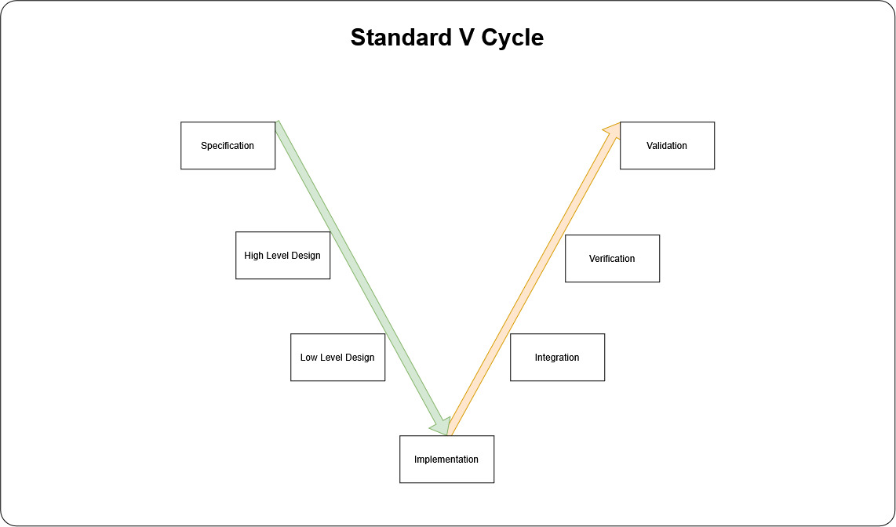

### Left Side of the V: Development Phases

1. Specification
   - Understand the needs.
   - Define the requirements clearly.

2. High-Level Design
   - Define the overall architecture.
   - Decide how the system will be organized.

3. Low-Level Design
   - Define detailed components and internal behavior.
   - Specify how each part will work.

4. Implementation
   - Build the actual software and hardware.
   - Create the code, PCB, and mechanical realization.

### Right Side of the V: Integration, Verification and Validation

After implementation, we move to the verification and validation phase of the V Cycle. This is where we confirm that the product is correct, safe, and aligned with the initial requirements.

1. Integration
   - We combine the different parts of the system together.
   - We check that software, hardware, and interfaces work correctly as a whole.

2. Verification
   - We verify that each element and each subsystem behaves as expected.
   - This includes checking requirements, reviewing design choices, and performing tests.

3. Validation
   - We validate that the final product really satisfies the user's and customer's needs.
   - This is the step where we ask: "Did we build the right system?"

In some engineering teams, a unit test is also added between the implementation phase and the integration phase. A unit test is a small test that checks one specific function, module, or component in isolation. For example, in software, we can test a function that calculates a temperature threshold to ensure it returns the correct value for different inputs. It helps detect errors early, before the full system is assembled.

For now, we do not use unit testing in this training, because our focus is first on understanding the overall V Cycle and the importance of requirements, design, and integration.

The goal is to confirm that the final product satisfies the original requirements and is ready for real use.

## Why the V Cycle Matters

The V Cycle matters because it helps us avoid expensive mistakes. It gives us a structured way to move from requirements to a final verified product.

It also reminds us that verification should not happen only at the end. In a good engineering process, we think about testing and validation from the beginning.

## How Long Does One V Cycle Take?

The time required for one V Cycle depends on the complexity of the system.

For a small subsystem, one V Cycle may take a short time. For a larger embedded product, it may take weeks or even months. In many industrial projects, teams may complete one V Cycle, then refine the design and start another one. In some cases, a project may require two or even three V Cycles before the product is mature enough for production.

This is normal.

The important point is that each cycle helps improve quality, reduce risk, and make the final product more reliable.

## Reflection

Before we continue, think about this:

- What is more expensive: discovering a mistake early or discovering it late?
- Why is planning important in embedded systems?
- Why can a small change in hardware cause a large delay in a project?

The answer is simple: good engineering is not only about building something. It is about building the right thing, in the right way, and with enough confidence that it will work.

That is the real purpose of requirement engineering and the V Cycle.

## Understanding Systems, Subsystems, and Units

In engineering, we often talk about systems, subsystems, and units. For us, an equipment is considered a system.

A system is a complete product that performs a function. It is made of different parts that work together to achieve one goal.

A system of systems is a larger set of connected systems that interact with each other. For example, in an aircraft or industrial machine, one subsystem may control power, another may manage communication, and another may handle sensing or actuation.

A subsystem is a smaller part of the overall system. It has its own role, but it also depends on the rest of the system to work correctly.

A unit is an even smaller element, such as a specific electronic component, a software module, or a mechanical part.

For our purpose, an equipment is considered a system because it contains several domains working together:

- Hardware, such as PCBs, connectors, harnesses, sensors, and power circuits
- Mechanical parts, such as the case, brackets, screws, covers, and mounting structures
- Software, such as firmware, binaries, configuration files, embedded control logic, communication routines, and user interfaces

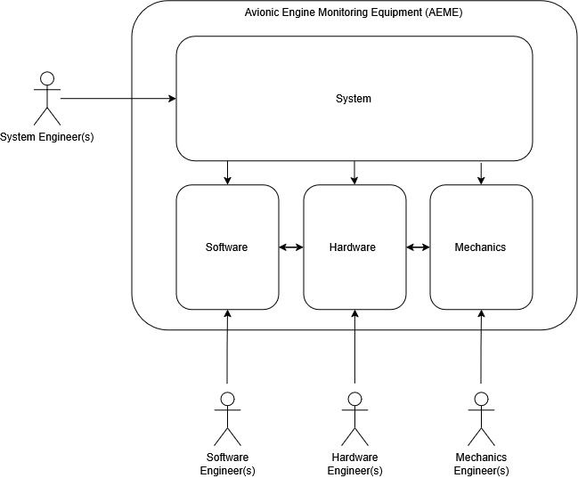

These three domains are not independent. They must work together correctly.

## Interfaces Between Domains

A very important idea in engineering is that interfaces exist between the different parts of the system. If these interfaces are not well defined, the system can fail even if each part seems correct on its own.

### Hardware-Software Interface

The hardware-software interface defines how the software interacts with the hardware. This is essential in embedded systems.

Examples of hardware-software interfaces include:

1. The pins used on the microcontroller or processor
2. The GPIO configuration and signal direction
3. The communication protocols, such as SPI, I2C, UART, or CAN
4. The voltage levels used by the electronic components
5. The clock frequency and timing requirements
6. The interrupt lines and event triggers
7. The analog input ranges and sampling rates
8. The power supply constraints and current limits
9. The reset and startup behavior of the hardware
10. The sensor and actuator connection mapping

### Mechanical-Hardware Interface

The mechanical-hardware interface defines how the hardware is physically mounted and connected to the mechanical structure.

Examples of mechanical-hardware interfaces include:

1. The locations where screws and fasteners are placed
2. The way the PCB is fixed inside the case
3. The grounding path to the metallic case
4. The placement and attachment of connectors and LEDs
5. The clearance between components and the enclosure
6. The routing of cables and harnesses
7. The vibration and shock constraints of the assembly
8. The thermal contact between components and the mechanical frame
9. The positioning of antennas, displays, or switches
10. The mechanical protection of sensitive electronic parts

Understanding these interfaces is essential because a good system is not only made of good parts. It is made of parts that fit together correctly at the level of function, structure, and communication.


# Full V Cycle of the System and Units with inputs and output documents

Here is the full V Cycle for the system an units, the X-axis represents the time axis.

As you can see, the system V cycle is the first to starts. Then comes in parallel the hardware and mechanical's V cycles. Last comes the software's cycle.

Yet, all engineer have to collaborate on early technical question that overlaps between system level, hardware, mechanical and software too.


## Requirement Engineering

Before diving into each document, it is important to understand the concept of requirement engineering. [You have to read this!](./requirement_engineering.md).

## List of documents during the development phases

First, let us explain the documents that are on the left side of each V cycle. These are the documents used for planning and designing before implementation begins. We will use as an example a desktop clock that has a display, a buzzer, and a button.

___
### System Level Documents

<details>
  <summary><strong>Client Requirements</strong></summary>

  - Scope: capture what the customer wants the system to do, the business goals, constraints, and success criteria.
  - Common traps:
    - Writing implementation details instead of needs.
    - Leaving requirements vague or unmeasurable.
    - Missing non-functional rules such as safety, reliability, or maintainability.
  - Good tips:
    - Use simple, user-focused language.
    - Make each requirement testable and measurable.
    - Separate must-have items from optional or future ideas.

[Example of Client Requirements](./Client%20Requirements.json)

</details>

<details>
  <summary><strong>System Specification</strong></summary>

  - Scope: translate client requirements into a structured description of the system, its interfaces, and its expected behavior.
  - Inputs:
    - Client Requirements: that have "System" allocation.
  - Common traps:
    - Mixing high-level system goals with low-level design decisions.
    - Omitting important interfaces between hardware, software, and mechanics.
    - Not tracking which requirement each specification line supports.
  - Good tips:
    - For each client requirement, define one or more system specifications that describe how the system will meet that need.
    - Keep the specification organized by system functions and interfaces.
    - Include clear acceptance criteria for each part.
    - Review the specification with hardware, software, and mechanical stakeholders.

[Example of System Specification](./System%20Specifications.json)

</details>

<details>
  <summary><strong>Functional Diagram</strong></summary>

  - Scope: show the system’s main functions and how they connect, without describing the exact components or implementation.
  - Common traps:
    - Turning the diagram into a wiring or hardware layout.
    - Using too many detailed elements that hide the big picture.
    - Not showing the data or signal flow clearly.
  - Good tips:
    - Focus on functions and data paths rather than physical parts.
    - Use consistent symbols and labels.
    - Keep it readable for non-specialists.

Example of Functional Diagram:

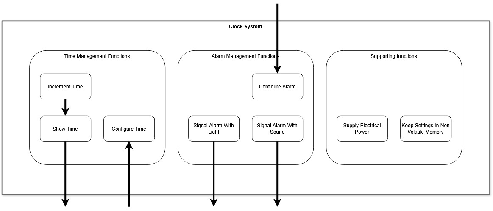

</details>

<details>
  <summary><strong>Use Case Diagram</strong></summary>

  - Scope: describe how users or external systems interact with the system, and what the system must do in each scenario.
  - Common traps:
    - Missing important actors or use cases.
    - Writing use cases as internal design steps instead of user goals.
    - Forgetting error cases, maintenance, or abnormal situations.
  - Good tips:
    - Start with the main user goals and add secondary interactions later.
    - Label each use case with a concise action phrase.
    - Link use cases back to requirements when possible.

The following relationships are used in use case diagrams:

1. Include Relationship («include»):

  - The Include relationship is used to extract common, repetitive behavior from multiple use cases into a single, shared use case.
  - The base use case cannot complete its goal without the included use case.
  - The included use case executes automatically when the base use case runs.
  - Arrow Type: A dashed line with an open arrowhead, labeled with the stereotype «include».
  - Arrow Direction: Points away from the base use case and toward the included use case.

2. Extend Relationship («extend»):

  - The Extend relationship is used to model optional, conditional, or exceptional behavior that may augment a base use case under specific circumstances.
  - Behavior: Optional. The base use case is fully functional on its own and can complete without the extending use case.
  - Arrow Type: A dashed line with an open arrowhead, labeled with the stereotype «extend».
  - Arrow Direction: Points away from the extending use case and toward the base use case.

3. Generalization Relationship:

  - The Generalization relationship represents inheritance. It is used when a specialized use case inherits all the behaviors, goals, and relationships of a more abstract use case.
  - Behavior: Structural classification (is-a-kind-of relationship).
  - Arrow Type: A solid line with a hollow triangular arrowhead.
  - Arrow Direction: Points away from the specialized (child) use case and toward the generalized (parent) use case.

Example of Use Case Diagram:

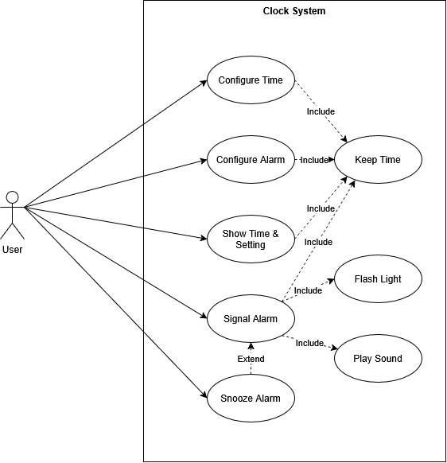

</details>

<details>
  <summary><strong>State Diagram</strong></summary>

  - Scope: define the system or subsystem states and the transitions that occur based on events, inputs, or conditions.
  - Common traps:
    - Creating too many states for the same behavior.
    - Ignoring what happens on invalid or unexpected inputs.
    - Mixing state transitions with implementation details.
  - Good tips:
    - Keep states meaningful and distinct.
    - Show both normal and error transitions.
    - Use it for behavior that depends on mode, sequence, or lifecycle.
    - If needed, create separate state diagrams for different subsystems or components.

Here is an example:

(Notice how we used the word "ALARM_DURATION" instead of a 1 minute. [The source of truth](./requirement_engineering.md) for this value is the [System Specifications](./System%20Specifications.json), and we want to keep the state diagram generic and reusable if the value changes.)

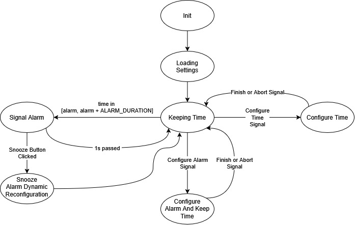

</details>

<details>
  <summary><strong>Sequence Diagram</strong></summary>

  - Scope: **For each use case**, describe the order of interactions between system elements and actors over time for a specific scenario.
  - Common traps:
    - Drawing a sequence diagram for every small detail instead of the important flows.
    - Including implementation details like exact function names or variable values.
    - Forgetting to show timing constraints or delays when they matter.
  - Good tips:
    - Use sequence diagrams for complex protocols, startup flows, or use case execution.
    - Keep each diagram focused on one scenario.
    - Label messages with the type of data or command being exchanged.

Here is an example:

(Notice how we kept the interactions vague and generic, we are still in System Level Design. We do not want to constraint the implementation details. What message is exactly sent, what format what timing, all this, as long as we can, we will let the Software and Hardware teams decide.)

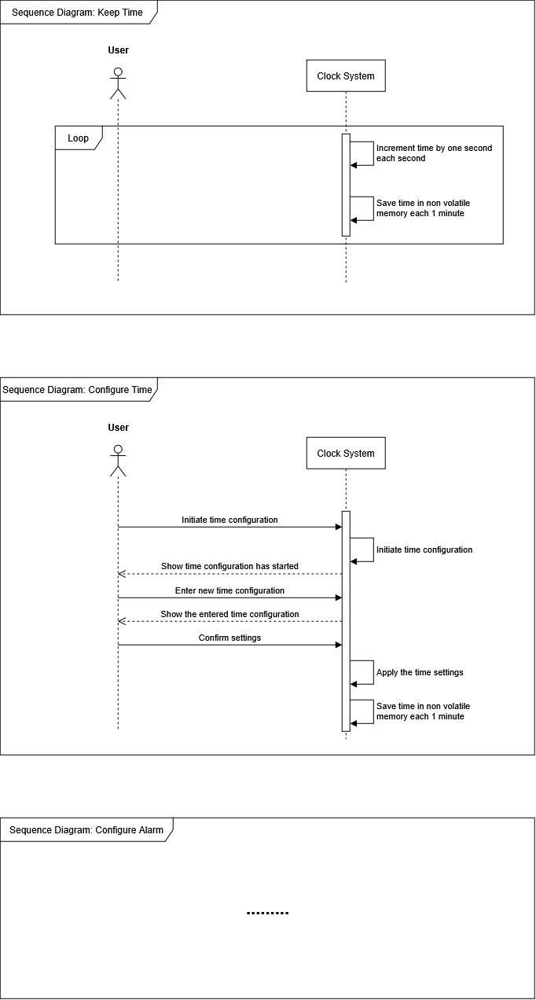

</details>

<details>
  <summary><strong>Block Diagram</strong></summary>

  - Scope: show the main physical (not logical) blocks of the system and their major connections.
  - Common traps:
    - Confusing block diagrams with detailed circuit diagrams.
    - Drawing too many blocks so the diagram becomes cluttered.
    - Not identifying the boundaries between hardware, software, and mechanics.
  - Good tips:
    - Use block diagrams to communicate the architecture at a glance.
    - Clearly separate blocks by domain or subsystem.
    - Add labels for the main interfaces and signals.

Example of Block Diagram:
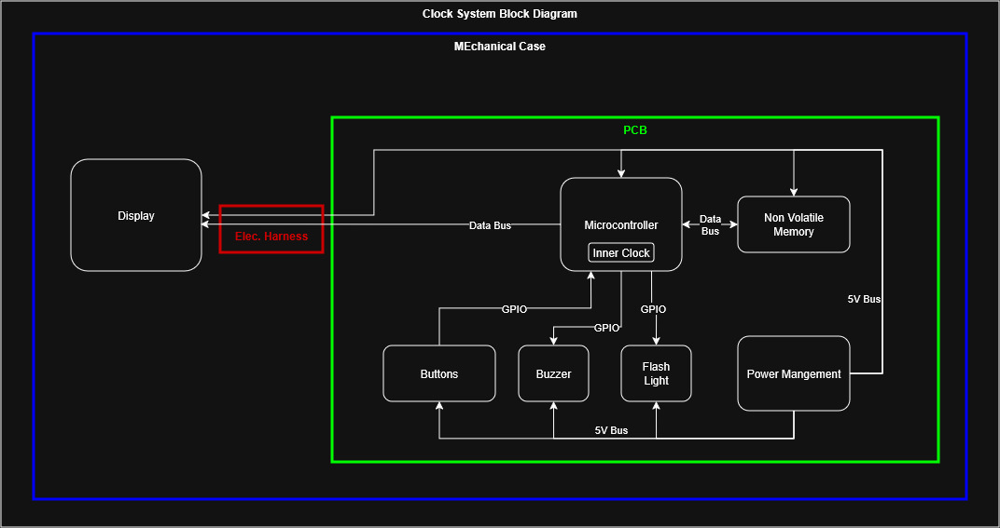

</details>

___
### Hardware Level Documents

<details>
  <summary><strong>Hardware Specification</strong></summary>

  - Scope: define the hardware specifications for the system, including electrical performance, power, sensors, actuators, and physical form factors.
  - Inputs:
    - System Specification: that has "Hardware" allocation.
  - Here, specification should be allocated to "PCB" or "Harness". If the system include multiple PCBs or harnesses, each should have its own codename like "PCB-001" or "Harness-001", "PCB-Motherboard", "PCB-Display"...
  - Common traps:
    - Describing how the hardware should be built instead of what it must achieve.
    - Omitting the electrical environment, EMI/EMC, and thermal constraints.
    - Not linking hardware specifications back to system-level specifications.
  - Good tips:
    - For each system specification that has "Hardware" allocation, define one or more hardware specifications that describe how the hardware will meet that need.
    - Include clear values for voltage, current, frequency, and signal levels.
    - Specify interfaces, connector types, and physical dimensions.
    - Keep it technology-agnostic until the design phase.

  - Common aspects to cover in a hardware specification:
    - The exact references to the major parts:
      - Microcontroller or processor
      - Sensors and actuators
      - Power supply and regulators
      - Communication interfaces (wired/wireless)
      - Connectors and cables
    - Electrical specifications: voltage, current, power, frequency, signal levels
    - Environmental specifications: temperature range, humidity, vibration, shock
    - Mechanical specifications: size, weight, mounting, enclosure constraints
    - Interface specifications: connectors, pinouts, communication protocols
    - Safety and regulatory specifications: EMI/EMC, certifications, isolation
    - Performance specifications: response time, accuracy, resolution

</details>

<details>
  <summary><strong>Hardware Mechanical Interface Specification</strong></summary>

  - Scope: define how the electronic hardware fits into the mechanical design, including mounting, enclosure clearances, and structural constraints.
  - Here, specification should be allocated to "Mechanical" to have this as an input to the Mechanical Specification.
  - Common traps:
    - Leaving mechanical mounting and fastener details undefined.
    - Assuming the PCB can fit anywhere inside the case without verifying sizes.
    - Forgetting to define grounding, shielding, and thermal paths.
  - Good tips:
    - Specify connector locations, mounting hole positions, and board envelope.
    - Define required clearance to moving parts or thermal elements.
    - Describe mechanical loads, vibration, and sealing specifications if relevant.

</details>

<details>
  <summary><strong>Hardware Software Interface Specification</strong></summary>

  - Scope: define the exact connection between the hardware and the firmware/software, including pins, signals, protocols, frequencies, phases, and timings.
  - Here, specification should be allocated to "Software" to have this as an input to the Software Specification.
  - Common traps:
    - Using generic labels like "signal 1" instead of real names.
    - Leaving timing or voltage levels unspecified.
    - Not identifying which subsystem owns each interface.
  - Good tips:
    - List pin assignments, communication buses, and expected signal behavior.
    - Include timing diagrams or protocol notes for critical interfaces.
    - Keep the document up to date with both the hardware and firmware teams.

Example:

```json
[
  {
    "identifier": "CLOCK-HSI-005",
    "title": "GPIO allocation for snooze button and alarm LED",
    "text": "The system shall assign STM32 GPIO1 as an input for the snooze button and STM32 GPIO2 as an output for the alarm status LED. The GPIO configuration shall support user input detection and LED actuation with a stable logic level during normal operation.",
    "verification_method": "Test",
    "parent": "CLOCK-CR-0014",
    "allocation": "Software;Hardware",
    "variant": "current"
  },
  {
    "identifier": "CLOCK-HSI-006",
    "title": "SPI communication configuration",
    "text": "The system shall use the SPI1 peripheral with STM32 GPIO5 as SCK, GPIO6 as MOSI, GPIO7 as MISO, and GPIO8 as CS. The SPI configuration shall operate as master at 1 MHz, 8-bit data frame, MSB first, CPOL = 0, CPHA = 1, and mode 1 for communication with the external peripheral or display.",
    "verification_method": "Test",
    "parent": "",
    "allocation": "Software;Hardware",
    "variant": "current"
  }
]
```

</details>

<details>
  <summary><strong>Hardware Block Diagram</strong></summary>

  - Scope: show the main physical hardware blocks and their interconnections, without going into detailed component-level design.
  - Common traps:
    - Treating the block diagram as a schematic or routing guide.
    - Including too many low-level components that make the diagram noisy.
    - Not showing how major blocks connect to power and external interfaces.
  - Good tips:
    - Use it to communicate the overall hardware architecture.
    - Keep blocks at the level of boards, power converters, sensors, and interfaces.
    - Label major connections clearly, such as power, data, and ground.

</details>

<details>
  <summary><strong>Schematics</strong></summary>

  - Scope: provide the detailed electrical design of the hardware, showing components, nets, and connections.
  - Common traps:
    - Creating schematics with unclear net names or missing references.
    - Not verifying the schematic against the actual PCB layout.
    - Leaving power rails, decoupling, or protection components undocumented.
  - Good tips:
    - Use readable annotation and standardized symbols.
    - Verify that schematics match the selected components and footprints.
    - Include important notes on power sequencing and startup behavior.

</details>

<details>
  <summary><strong>PCB Routing</strong></summary>

  - Scope: document the routing rules and layout decisions for the printed circuit board, including trace widths, clearances, and layer usage.
  - Common traps:
    - Treating PCB routing as a purely graphical exercise without documented rules.
    - Ignoring signal integrity, return paths, and high-speed routing constraints.
    - Not documenting the purpose of specific trace layouts such as differential pairs.
  - Good tips:
    - Define stack-up, impedance needs, and layer assignments.
    - Document special routing specifications for sensitive or high-current nets.
    - Review the routed board with electrical and mechanical teams before finalizing.

</details>

<details>
  <summary><strong>Harness Pin-to-Pin Interface Specification</strong></summary>

  - Scope: define every cable harness in the system, including connector pin assignments, conductor routing, electrical limits, mechanical constraints, and EMC protection specifications.
  - Common traps:
    - Treating the harness as a simple wire list with no electrical or mechanical constraints.
    - Forgetting shield, grounding, impedance, or length limits for sensitive signals.
    - Not identifying which connector pin goes to which board, sensor, actuator, or subsystem.
    - Ignoring vibration, bend radius, routing path, and serviceability constraints.
  - Good tips:
    - List every pin, connector, signal name, net name, wire gauge, and function.
    - Include limits for voltage, current, impedance, signal integrity, temperature, and EMC behavior.
    - Document the harness length, routing constraints, bend radius, stiffness, shielding, and attachment points.
    - Review this document with hardware, software, mechanical, and manufacturing teams.

  Typical data to capture for each harness:

  - Harness identifier and description
  - Source and destination equipment or PCB
  - Connector type, manufacturer, part number, and pin count
  - Pin-to-pin mapping table: connector A pin, connector B pin, signal, function, net name, ground reference, return path
  - Wire gauge, conductor material, insulation type, and shielded/unshielded configuration
  - Maximum voltage and current per conductor
  - Signal type: analog, digital, power, ground, high-speed, low-noise, or sensor return
  - Impedance specifications for differential or high-speed signals
  - EMC and EMI specifications: shielding, twisted pair use, grounding strategy, separation from noisy lines
  - Maximum harness length and allowable length tolerance
  - Bend radius, rigidity or flexibility specification, routing path, and strain relief strategy
  - Vibration, shock, and temperature operating limits
  - Connector mating cycle expectation and retention mechanism
  - Environmental protection: sealing, abrasion resistance, chemical compatibility, and UV exposure
  - Test points, debug access, and inspection criteria

</details>

<details>
  <summary><strong>PCB and Electronics Bill of Materials</strong></summary>

  - Scope: list all electronic components, PCB assemblies, connectors, sensors, actuators, passives, protection parts, and purchased items required for the design.
  - Common traps:
    - Mixing the PCB BOM with the mechanical BOM or assembly BOM.
    - Forgetting quantities, values, tolerances, package types, or manufacturer part numbers.
    - Not linking parts to their function, board reference, or electrical interface.
  - Good tips:
    - Use a clear table with item, reference designator, description, value/package, quantity, manufacturer, and source.
    - Include board-level references such as PCB-001, MCU, sensor, buzzer, power supply, and connectors.
    - Keep the BOM aligned with the schematic, PCB layout, and test specifications.

</details>

___
### Software Level Documents

<details>
  <summary><strong>Software Specification</strong></summary>

  - Scope: define the software specifications and behavior, based on the system specification and hardware-software interfaces.
  - Inputs:
    - System Specification: that has "Software" allocation.
    - Hardware Software Interface Specification: these all have "Software" allocation.
  - Common traps:
    - Writing software design details instead of specifications.
    - Not accounting for hardware constraints such as pin usage, timing, and resource limits.
    - Leaving out error handling, startup, and shutdown behavior.
  - Good tips:
    - For each input specification (System or Hardware Software Interface), specify the expected software response and any constraints.
    - If you find that a specification is not applicable to software, discuss it with the System Engineer or Hardware Engineer.
    - If you find that 
    - Make the software specifications clear, measurable, and linked to the system needs.
    - Include required interfaces, inputs/outputs, and expected responses.
    - Review the spec with hardware and system engineers to ensure consistency.


</details>

<details>
  <summary><strong>Software State Diagram</strong></summary>

  - Scope: describe the software states and transitions for modules or control flows that depend on modes or events.
  - Common traps:
    - Using state diagrams for simple linear code where they add no value.
    - Ignoring unexpected events or failure modes in the state transitions.
    - Mixing states with implementation details like specific functions.
  - Good tips:
    - Usually, state diagrams includes an init state, maintenance states, and error states. Plus the different functional states that the system can be in.
    - Use state diagrams for mode-based logic, startup/shutdown sequences, or communication state machines.
    - Include both normal and error transitions.
    - Keep state names meaningful and avoid over-complicating the diagram.

</details>

<details>
  <summary><strong>Flowchart Diagram</strong></summary>

  - Scope: show the step-by-step logic of a process or algorithm, including decisions, loops, and actions.
  - Common traps:
    - Drawing flowcharts for every tiny function instead of key algorithms.
    - Making the chart too detailed, which hurts readability.
    - Using inconsistent symbols or unclear labels.
  - Good tips:
    - Use flowcharts for important algorithmic flows, initialization, and control loops.
    - Can be used as one global flowchart for the whole software, or one flowchart per state/module.
    - Keep diagrams focused and easy to follow.
    - Annotate decisions with clear conditions.

</details>

<details>
  <summary><strong>Component Diagram</strong></summary>

  - Scope: show the main software modules, their relationships, and the dependencies between them.
  - Common traps:
    - Drawing a diagram with too many tiny modules that look like a code-level class map.
    - Leaving dependencies vague or implicit.
    - Not showing which components map to hardware interfaces or system functions.
  - Good tips:
    - Group components by functional area.
    - Show data flow or interface direction when useful.
    - Use it to explain code architecture.
    - Use at least 3 Levels:
      - Level 1: Application
        - The main software application, project and product related.
      - Level 2: BSP
        - The Board Support Package, the software that is specific to the hardware peripheral and the board.
        - Can be used for other projects or products that use the same hardware units.
      - Level 3: HAL
        - The Hardware Abstraction Layer, the software that is specific to the hardware peripheral and the Micro Controller.
        - Can be used for other projects or products that use the same microcontroller.

Example of Component Diagram:

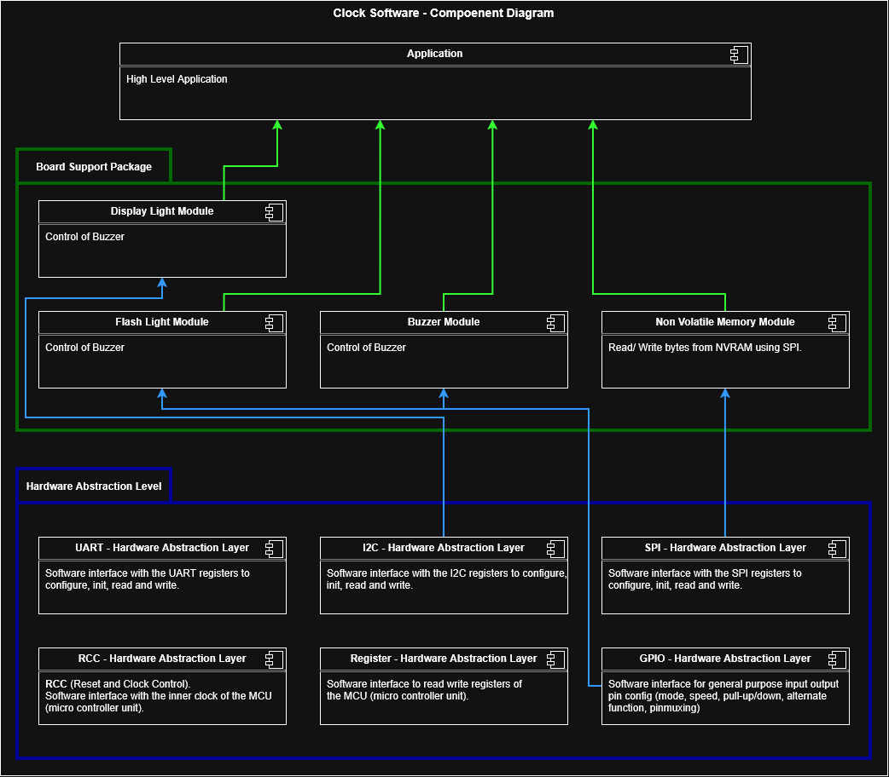

</details>

<details>
  <summary><strong>Software Sequence Diagram</strong></summary>

  - Scope: illustrate the runtime interaction between software components, hardware interfaces, and external actors for a given scenario.
  - Common traps:
    - Showing only internal code calls instead of meaningful system interactions.
    - Making the sequence too long and hard to read.
    - Not specifying the context or scenario clearly.
  - Good tips:
    - Use sequence diagrams for startup, communication exchanges, and critical event handling.
    - Keep each diagram limited to a single use case or flow.
    - Label messages with the type of data or action.

</details>

<details>
  <summary><strong>Class Diagram</strong></summary>

  - Scope: **for each component**, define the major software classes or structures, their attributes, methods or functions, and their relationships.
  - Common traps:
    - Using a class diagram as a literal map of every source file.
    - Including unnecessary implementation details.
    - Not updating the diagram as the design evolves.
  - Good tips:
    - Use class diagrams to describe the software design at a higher level.
    - Focus on important entities, interfaces, and relationships.
    - Keep it aligned with the software specification and component model.
    - Describe modules (.c .h .py .cfg ...), their major parameters, functions, and how they interact with other modules.

Here is an unrelated example of a class diagram:

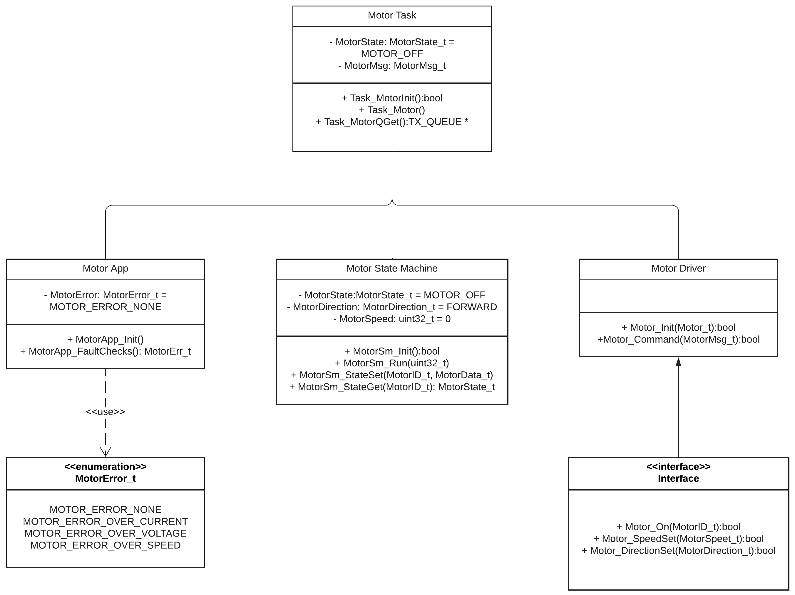

</details>

___
### Mechanical Level Documents

<details>
  <summary><strong>Mechanical Specification</strong></summary>

  - Scope: define the mechanical specifications for the system, including assemblies, enclosures, load-bearing structures, and environmental constraints.
  - Common traps:
    - Writing the design before the mechanical specifications are fully understood.
    - Ignoring thermal management, vibration, or manufacturability issues.
    - Leaving mechanical tolerances and fit specifications vague.
  - Good tips:
    - Describe the mechanical functions and the conditions the design must endure.
    - Capture required dimensions, materials, and surface finishes.
    - Include maintenance and access specifications when relevant.

</details>

<details>
  <summary><strong>Mechanical Block Diagram</strong></summary>

  - Scope: show the main mechanical subsystems and their relationships in a high-level design view.
  - Common traps:
    - Confusing mechanical block diagrams with detailed CAD drawings.
    - Showing every small bracket or fastener instead of major assemblies.
    - Leaving the relationship to hardware and software unclear.
  - Good tips:
    - Use it to explain the mechanical architecture and assembly flow.
    - Keep blocks at the level of enclosures, frames, modules, and major interfaces.
    - Identify which blocks interact with hardware or software components.

</details>

<details>
  <summary><strong>Parts (CAD models)</strong></summary>

  - Scope: capture the detailed geometry of mechanical parts, usually in CAD file formats like SLDPRT.
  - Common traps:
    - Keeping CAD models undocumented or without part metadata.
    - Using overly generic parts when the design needs custom geometry.
    - Not verifying the model against interface and assembly specifications.
  - Good tips:
    - Keep CAD models organized with clear names and version control.
    - Include notes on critical dimensions and fit tolerances.
    - Share models with hardware and assembly teams for integration review.

</details>

<details>
  <summary><strong>Assembly (CAD assembly)</strong></summary>

  - Scope: define how mechanical parts fit together and how the overall product is assembled.
  - Common traps:
    - Treating assembly models as perfect instead of checking for real-world manufacturing and assembly issues.
    - Not documenting assembly order, fasteners, or required tools.
    - Ignoring serviceability and access for maintenance.
  - Good tips:
    - Use assembly CAD to validate fit, clearance, and part interactions.
    - Document the assembly sequence and critical join points.
    - Review the model with manufacturing and test engineers to catch problems early.

</details>

<details>
  <summary><strong>Bill of Materials</strong></summary>

  - Scope: list all mechanical parts, fasteners, materials, and purchased items required for the design.
  - Common traps:
    - Including incomplete or inconsistent part numbers.
    - Forgetting to list quantities, material grades, or supplier details.
    - Not linking parts to their function or assembly location.
  - Good tips:
    - Use a clear table with part, description, quantity, and source.
    - Include reference designators or assembly locations.
    - Keep the BOM updated as the design evolves.

</details>

___
## List of documents during the verification phases

Now that we talked about the documents on the left side of the V cycle, let us talk about the documents on the right side of the V cycle. These are the documents used for verification and validation after implementation is done.

This time, these documents are basically the same for all units, so let's explain them once and for all and let's take as an example the software units.

<details>
  <summary><strong>X Verification and Test Procedures</strong></summary>

  - Scope: For each specification, define the test procedure to verify that the implementation meets the requirement. This includes test setup, inputs, expected outputs, and pass/fail criteria.
  - Common traps:
    - Not defining the test environment (on which hardware, software, or mechanical setup the test is performed).
    - Not defining the setup phase.
    - Not highlighting the expected results and pass/fail criteria.
  - Good tips:
    - One test procedure can verify multiple specifications, but each specification should have at least one test procedure.
    - One specification can be verified by multiple test procedures, but each test procedure should verify at least one specification.
    - For requirements that have verification method "Test", you must have at least one test procedure that verifies it.
      - A test procedure is a document that describes how to set up the test environment, what inputs to provide, what outputs to expect, and how to determine if the requirement is met. Example, for a requirement that says "The system shall turn on the LED when the button is pressed", the test procedure would describe how to connect the button and LED, how to press the button, and what to observe on the LED.
    - For requirements that have verification method "Analysis", you must have at least one analysis procedure that verifies it.
      - An analysis procedure is a document that describes how to analyze a design or a document to verify that it meets the requirements. It can be a calculation, a simulation, or a formal proof. Example, calculate the power consumption of the system and verify that it is less than the maximum allowed power consumption in the product specification.
    - For requirements that have verification method "Review", you must have at least one review procedure that verifies it.
      - A review procedure is a document that describes how to review a document or a design to verify that it meets the requirements. It can be a checklist, a set of questions, or a set of criteria to check. Example, read a datasheet for number of cycles that a button can withstand, and verify that it is more than the expected number of cycles in the product lifetime.

Example:

```
CLOCK-Software-Test-Procedure-001: Verify snooze button functionality
  Covered Specifications: CLOCK-SW-0029; CLOCK-SW-0030
  Test Environment: Software test bench.
  Test:
    step: Power on the test bench.
    step: Flash the tested software binary.
    step: Set the snooze duration to 5 minutes.
    step: Set the alarm duration to 2 minutes.
    step: Set the alarm to trigger in 1 minute.
    step: Wait for 1 minute.
    verification: Verify that alarm triggers correctly.
    expected result: Alarm triggers after 1 minute.
    step: Press the snooze button.
    verification: Verify that the alarm has stopped.
    expected result: Alarm stops immediately.
    step: Wait for 5 minutes.
    verification: Verify that the alarm triggers again after the snooze duration.
    expected result: Alarm triggers after 5 minutes.
    step: Wait for 2 minutes.
    verification: Verify that the alarm stops after the alarm duration of 2 minutes.
    expected result: Alarm stops after 2 minutes.
    step: Power off the test bench.

CLOCK-Software-Test-Procedure-002: Verify flash light functionality
...
...


CLOCK-Software-Review-Procedure-001: Review button maximum number of cycles
  Covered Specifications: CLOCK-SW-0019; CLOCK-SW-0039
  Review Environment: Datasheet of the button PDF name 245264 revision A issue 2.
  Review:
    step: Read the datasheet of the button PDF name 245264 revision A issue 2.
    verification: Verify that the button can withstand at least 100,000 cycles.
    expected result: Button can withstand at least 100,000 cycles.

...
...

```

</details>

<details>
  <summary><strong>X Verification Results</strong></summary>

  - Scope: For each test or analysis procedure, record the actual results, observations, and whether the requirement was met.
  - Common traps:
    - Not recording the actual test environment, inputs, and outputs.
    - Not documenting any anomalies or unexpected behavior.
    - Not linking results back to the specific requirements and procedures.
    - Not recording on which version of the software, hardware, or mechanical unit the test was performed.
    - Not recording the date, timestamps of start and end of each procedure, and the name of the person who performed the test.
  - Good tips:
    - If the result of a verification step is different from the expected result, mark the test as failed, do not try to fix the procedure, it should be discussed for next V cycle iteration.
    - Use a clear format to capture the test setup, inputs, outputs, and pass/fail status.
    - Write a summary of the overall verification results, highlighting any failures or issues that need to be addressed.

Example:

```

Test Executed: 125
Test Passed: 124
Test Failed: 1

CLOCK-Software-Test-Result-001: Verify snooze button functionality
  Covered Test Procedures: CLOCK-Software-Test-Procedure-001
  Test Environment: Software test bench.
  Version of the software tested: v1.0.0
  Version of the test bench: v1.5.0
  Timestamp of test execution: 2024-06-15 10:30:00
  Timestamp of test completion: 2024-06-15 10:45:00
  Name of the person who performed the test: John Doe
  Test:
    step: Power on the test bench.
    step: Flash the tested software binary.
    step: Set the snooze duration to 5 minutes.
    step: Set the alarm duration to 2 minutes.
    step: Set the alarm to trigger in 1 minute.
    step: Wait for 1 minute.
    verification: Verify that alarm triggers correctly.
    expected result: Alarm triggers after 1 minute.
    result: Alarm triggered correctly after 1 minute.
    step: Press the snooze button.
    verification: Verify that the alarm has stopped.
    expected result: Alarm stops immediately.
    result: Alarm stopped immediately.
    step: Wait for 5 minutes.
    verification: Verify that the alarm triggers again after the snooze duration.
    expected result: Alarm triggers after 5 minutes.
    result: Alarm triggered correctly after 5 minutes.
    step: Wait for 2 minutes.
    verification: Verify that the alarm stops after the alarm duration of 2 minutes.
    expected result: Alarm stops after 2 minutes.
    result: Alarm stopped correctly after 2 minutes.
    step: Power off the test bench.

  Results Summary:
    - PASS

CLOCK-Software-Test-Result-002: Verify flash light functionality
...
...
  Results Summary:
    - FAIL

CLOCK-Software-Review-Result-001: Review button maximum number of cycles
  Covered Specifications: CLOCK-SW-0019; CLOCK-SW-0039
  Review Environment: Datasheet of the button PDF name 245264 revision A issue 2.
  Timestamp of review execution: 2024-06-15 11:00:00
  Timestamp of review completion: 2024-06-15 11:15:00
  Name of the person who performed the review: Jane Smith
  Review:
    step: Read the datasheet of the button PDF name 245264 revision A issue 2.
    verification: Verify that the button can withstand at least 100,000 cycles.
    expected result: Button can withstand at least 100,000 cycles.
    result: Button can withstand 150,000 cycles.
  Results Summary:
    - PASS
```

</details>

<details>
  <summary><strong>X Problem Report</strong></summary>

  - Scope: Document any issues during the V cycle:
    - Issues with requirements,
    - Issues with specifications,
    - Issues with test procedures,
    - Issues with verification results,
    - Issues with the implementation (software, hardware, or mechanical),
    - Issues with the integration of the system,
    - Issues with the test bench or environment,
    - Issues with the documentation itself, version, typos...

  - Common traps:
    - Not linking the problem report to the specific requirement, test procedure, or verification result.
    - Not providing enough detail to reproduce or understand the issue.
    - Not tracking the status of the problem (open, in progress, resolved, rejected).
  - Good tips:
    - Include a clear description of the problem, steps to reproduce, and any relevant logs or screenshots.
    - Assign a priority and severity level to help with scheduling.
    - Keep the problem report updated with status changes and resolution notes.

Example:

```

Problem Report ID: CLOCK-PR-001
  Title: Snooze button does not trigger alarm delay
  Unit: Software                                        (choose one or many)
  Description: ...
  Steps to Reproduce: ...
  Environment: ...                                      (describe versions of software, hardware, setups)
  Severity: High
  Priority: Urgent
  Recommendation: ...
  Implementation of Correction: ...                     (example: to be found in document XX version YY.)
  Status: Open
  Reported By: John Doe
  Date Reported: 2024-06-15
  Linked Problem Reports: CLOCK-PR-002, CLOCK-PR-003

```

</details>

<details>
  <summary><strong>X Configuration Index</strong></summary>

  - Scope: This document summarizes where to find the files, how they were built, the tools to use and their versions, how to open, how to use them and how to recreate them.

##### Example Software Configuration Index

**Scope**: This document identifies where to find the files, how they were built, how to open/use them, and how to recreate them identically.

###### Source Code and Binary Identification

| Item | Value |
|---|---|
| Source repository | [https://github.com/my_repo/flight-ctrl-lru](https://github.com/my_repo/flight-ctrl-lru) |
| Version / tag used | `V01.01.12` |
| Source code integrity | `sha1 = 1a1210ce4848776414644564684456` |
| Binary artifact | [https://github.com/my_repo/flight-ctrl-lru/binaries/main-V01_01_12.bin](https://github.com/my_repo/flight-ctrl-lru/binaries/main-V01_01_12.bin) |
| Binary integrity | `sha256sum = 8445448ab8454541cf54864645e4564` |
| Target processor | ARM Cortex-M4 (STM32F407) |

###### Build Environment / Tools

| Tool | Version | Purpose |
|---|---|---|
| OS | Ubuntu 22.04.3 LTS (x86_64) | Build host |
| Toolchain | GNU Arm Embedded Toolchain `arm-none-eabi-gcc` **12.2.Rel1** (2022) | Cross-compilation |
| Binutils | `arm-none-eabi-binutils` 2.39 | Linking / object manipulation |
| Build tool | GNU Make 4.3 | Build orchestration |
| Linker script | `stm32f407.ld` (part of source repo, tag `V01.01.12`) | Memory layout |
| Version control | git 2.34.1 | Source retrieval |

> Note: the exact toolchain version matters — DO-178C for example requires the compiler and its configuration to be identified precisely, since different compiler versions (even patch versions) can generate different object code, and this affects the validity of verification results (structural coverage, robustness testing, etc. performed against a specific binary).

###### Building the Binary

1. **Clone the exact source baseline:**

```bash
git clone --depth 1 --branch V01.01.12 https://github.com/my_repo/flight-ctrl-lru.git flight-ctrl-lru
cd flight-ctrl-lru
```

2. **Verify source integrity against the SCI record:**

```bash
git rev-parse HEAD
# compare with the recorded commit hash: 1a1210ce4848776414644564684456
```

3. **Compile with the documented compiler and flags:**

```bash
arm-none-eabi-gcc \
  -std=c99 \
  -Wall -Wextra -Werror \
  -O2 \
  -mcpu=cortex-m4 \
  -mthumb \
  -mfloat-abi=hard \
  -mfpu=fpv4-sp-d16 \
  -ffreestanding \
  -fno-common \
  -fno-strict-aliasing \
  -DNDEBUG \
  -Iinclude \
  -c src/main.c -o build/main.o
```

4. **Link to produce the ELF executable:**

```bash
arm-none-eabi-gcc \
  -mcpu=cortex-m4 -mthumb -mfloat-abi=hard -mfpu=fpv4-sp-d16 \
  -T stm32f407.ld \
  -Wl,--gc-sections \
  -Wl,-Map=build/main.map \
  -nostartfiles \
  build/main.o -o build/main.elf
```

5. **Convert to the loadable binary:**

```bash
arm-none-eabi-objcopy -O binary build/main.elf build/main-V01_01_12.bin
```

6. **Verify binary integrity against the SCI record:**

```bash
sha256sum build/main-V01_01_12.bin
# expected: 8445448ab8454541cf54864645e4564
```


##### Why each flag/element matters for traceability

- **`-std=c99`** — freezes the language standard used; needed so a later recompilation with a newer default standard doesn't silently change behavior.
- **`-Wall -Wextra -Werror`** — makes the build fail on warnings, supporting the coding standard/compliance objective (DO-178C §11.8 for example) rather than silently accepting questionable code.
- **`-O2`** — the optimization level is part of the object code identity; verification (coverage analysis in particular) is tied to *this* optimization level. Changing it without re-verification invalidates prior test evidence.
- **`-mcpu / -mfloat-abi / -mfpu`** — target-specific ABI settings; a mismatch here would produce a binary incompatible with the qualified target hardware.
- **Linker script and map file** — required to reproduce the exact memory layout and to support the object-code-to-source traceability objective.
- **Fixed toolchain version** — the compiler itself is often subject to Tool Qualification (DO-330) if it can inject code not directly verifiable from source; its version must therefore be pinned and recorded exactly.


</details>

<details>
  <summary><strong>X Configuration Management Records</strong></summary>

  - Scope: This document should list the documents and files that constitutes a delivery of a version of what needed to be delivered. Where to find each file, how to identify it (hash code), and its version.

#### Example Of A Software Configuration Management Record

##### Input Documents And Files

| File name | Link | SHA-256 hash code (first 8 characters) | Version |
|---|---|---|---|
| System Specification Document.pdf | `./documents/software/System Specification Document.pdf` | `7f3a9c2d` | `V01.00.00` |
| Hardware Software Interface Specification Document.pdf | `./documents/hardware/Hardware Software Interface Specification Document.pdf` | `2c8e1a6b` | `V01.01.00` |

##### Design Phase Documents And Files

| File name | Link | SHA-256 hash code (first 8 characters) | Version |
|---|---|---|---|
| Software Specification Document.pdf | `./documents/software/Software Specification Document.pdf` | `9a4d7e1c` | `V01.02.00` |
| Software Design Document.pdf | `./documents/software/Software Design Document.pdf` | `1e6b3c8a` | `V01.03.00` |

##### Implementation Phase Documents And Files

| File name | Link | SHA-256 hash code (first 8 characters) | Version |
|---|---|---|---|
| Software_executable.bin | `./build/release/Software_executable.bin` | `b5d2f8a0` | `V01.04.00` |
| Software_configuration_file.cfg | `./config/Software_configuration_file.cfg` | `4c9a1e7d` | `V01.05.00` |

##### Verification Phase Documents And Files

| File name | Link | SHA-256 hash code (first 8 characters) | Version |
|---|---|---|---|
| Software Verification Cases Procedures.pdf | `./verification/procedures/Software Verification Cases Procedures.pdf` | `8d1f6a3c` | `V01.06.00` |
| Software Verification Results.pdf | `./verification/results/Software Verification Results.pdf` | `3a7e0c5d` | `V01.07.00` |

##### Configuration Phase Documents And Files

| File name | Link | SHA-256 hash code (first 8 characters) | Version |
|---|---|---|---|
| Software Configuration Index.pdf | `./configuration/Software Configuration Index.pdf` | `6f2b9d4a` | `V01.08.00` |
| Software Problem Report.pdf | `./configuration/records/Software Problem Report.pdf` | `0e5c8a3f` | `V01.04.00` |
| Software Configuration Management Record.pdf | `./configuration/records/Software Configuration Management Record.pdf` | `0e5c8a3f` | `V01.09.00` |

> The file names, links, hashes, and versions above are illustrative example data.

</details>

### Test Benches: Standalone Products To Automate Verification (Tests)

For each unit, we need to have a test bench that can be used to automate the verification of the unit.

A test bench is a standalone product that can be used to run the verification procedures and record the results.

Standalone means that it should be designed with a **dedicated V cycle**, it should have its own requirements, specifications, design, implementation, and verification.

Why? because test benches should be documented to be reproducible, reliable, traceable and deterministic. If we don't have a dedicated V cycle for the test bench, we will not be able to guarantee that.

#### System Test Bench

Usually, combines a PC, a DC/AC power supply controlled by the PC via a USB or Ethernet interface, some relays and Digital Input/Output (I/O) interfaces.

You put you product on the table, connect it to the test bench via harnesses, and run the verification procedures via automated python scripts (or other automation tools).

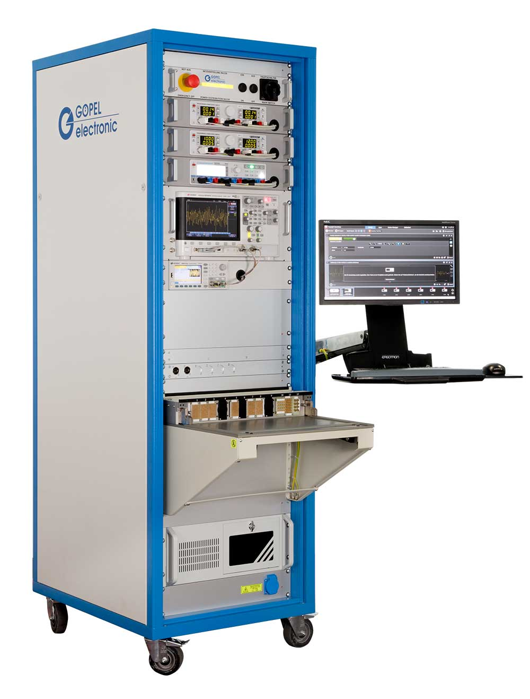


#### Hardware Test Bench

Usually, combines a PC, a DC/AC power supply controlled by the PC via a USB or Ethernet interface, some relays and Digital Input/Output (I/O) interfaces.

Instead of putting the whole product on the table, you put only the hardware unit (PCB or harness) on the table, connect it to the test bench via harnesses, and run the verification procedures via automated python scripts (or other automation tools).

The addition here is that, for testing pins and lines that are not exposed on the connectors, we add test points (or test pads) to the PCB during the design phase. Then we can use a test fixture that connects to the test points and allows us to test the internal signals of the PCB. The test fixture then slides down and touches the test points on the PCB, and allows us to test the internal signals of the PCB.

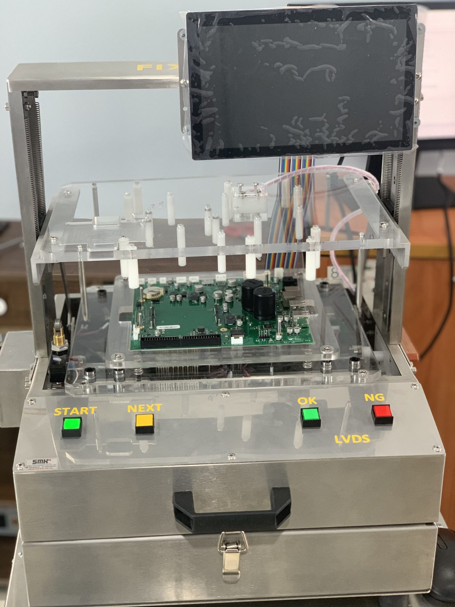

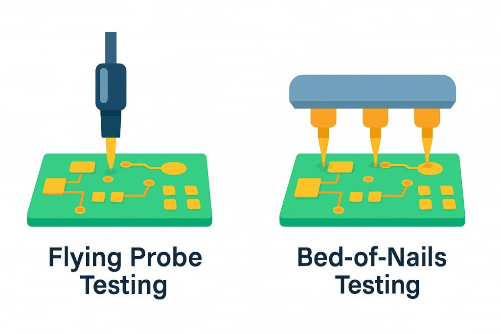

Notice in this picture of a Raspberry Pi board the different available test points that can be used to test the internal signals of the board.

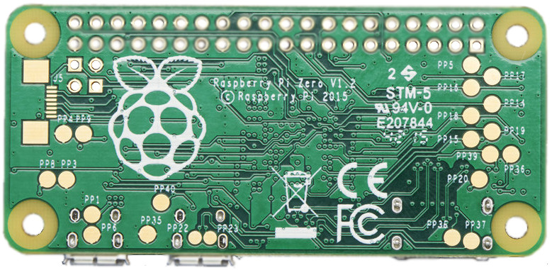


#### Software Test Bench

Well, the software test bench is usually a Linux Raspberry Pi with a Python interpreter and some libraries that allow us to run the verification procedures via automated python scripts (or other automation tools).

The physical platform we built is a real life example of a software test bench. Read the different stickers on the platform to understand the different components of the test bench.

## Full V Cycle Diagram with highlighting inter dependencies between the different units

Notice how some outputs of one unit are used as inputs to another unit.

The diagram below shows the full V cycle with the inter-unit dependencies highlighted.

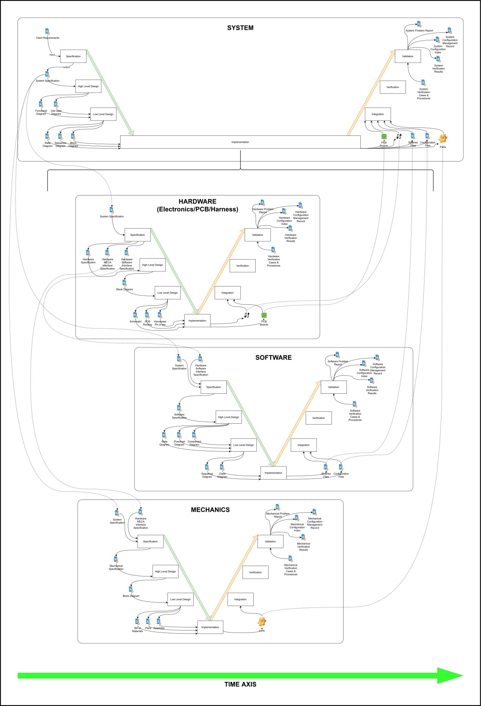


## Last Step: Traceability Matrixes

- To make sure that each requirement was implemented in the flow down through the different units.
- To make sure that each specification was tested.
- To make sure that each Verification Case was run.

To make sure that no requirement, specification, or verification case was missed, we need to create traceability matrixes.

A matrix is just a table that links each side to the other side.

A cross matrix is a document that has two matrixes:
  - One matrix that links the left side to the right side.
  - One matrix that links the right side to the left side.

The needed traceability cross matrixes are:

- Cross Matrix 1:
  - Input specifications to Output specification.
  - Output specifications to Input specifications.
  - Example:
    - System Specification to Hardware Interface Specification,
    - Hardware Interface Specification to System Specification.

- Cross Matrix 2:
  - Output specifications to Verification Cases.
  - Verification Cases to output specifications.
  - Example:
    - System Specification to System Verification Cases,
    - System Verification Cases to System Specification.

Cross Matrix 3:
  - Verification Cases to Verification Results.
  - Verification Results to Verification Cases.
  - Example:
    - System Verification Cases to System Verification Results,
    - System Verification Results to System Verification Cases.

Here is the full V cycle diagram with the traceability matrixes highlighted.

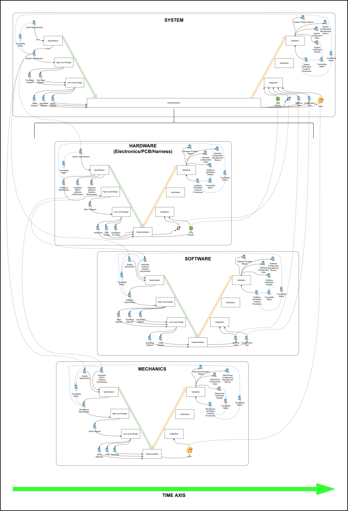


# End of Chapter 0

This is a lot to take at once, specially for a rookie.

Feel free to ask questions in the GitHub repository issues page, and we will try to answer them as best as we can.

Come back here every time you need to refresh your memory about the V cycle and the documents that are needed for each unit.

This is not exact science, and there are many ways to do it, but this is a good starting point for a rookie.

Each way of doing it has its own pros and cons, and we will discuss them if needed.
