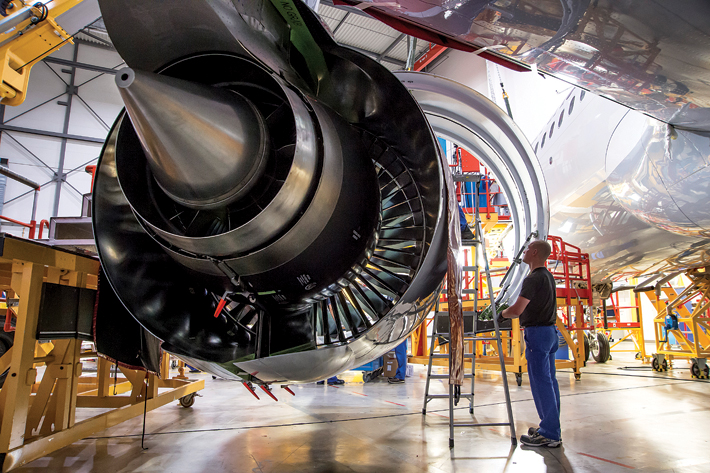
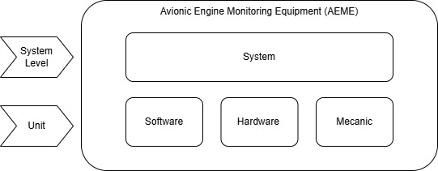
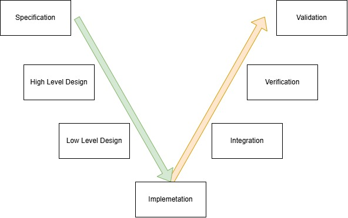
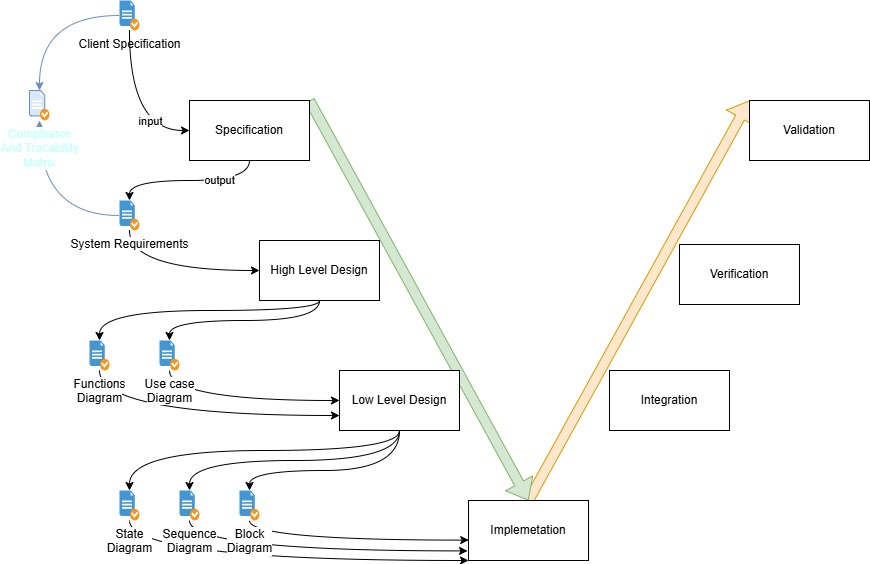

# 1. Welcome to our Nameless Aersopace Comapny

Hello, you just got hired by our company, and we are excited to have you on board!

As a new member of our team, we want to ensure that you have all the resources and support you need to succeed in your role.

We hope that you did read and mastered the [01_prerequisites_knowledge](../../01_prerequisites_knowledge/), the knowledge you gained from that chapter will be very helpful for you to understand the concepts and practices we will be using in our projects.

As mentioned during your hiring interview, we are working on an avionic project that requires expertise in embedded software development. We are confident that your skills and experience will be a valuable asset to our team.

# 2. Avionic Engine Monitoring Equipment (AEME) Project

We have a client that is looking for a solution to monitor the performance of their aircraft engines in real-time. They want to be able to collect data on various parameters such as temperature and pressure and make sure that the engine is operating within safe limits.

To achieve this, we will be developing an embedded software solution that can interface with the engine's sensors and collect data in real-time. We will also be implementing a user interface that allows the client to visualize the data and receive alerts if any parameters exceed safe limits.

# 3. Engineering Team

You will be working closely with our engineering team, which consists of:

1. Djamal Doe (as in John Doe), the System Architect, who will be responsible for designing the overall architecture of the software solution and ensuring that it meets the client's requirements.
2. Aziz, the Electronic and Hardware Engineer, who will be responsible for designing and implementing the hardware components of the solution, including the sensors and interfaces.
3. You, the Embedded Software Engineer, who will be responsible for developing the embedded software solution that interfaces with the hardware components and collects data in real-time.

You will also be working with:
- The project manager, who will be responsible for overseeing the project and ensuring that it is completed on time and within budget.
- The quality assurance team, who will be responsible for reviewing the process to make sure that we are following the avionic standards.

# 4. First Meeting with the System Architect

In your first meeting with Djamal, the System Architect, you will discuss the requirements of the project and the overall architecture of the software solution. Djamal will provide you with an overview of the project and explain how your role as an Embedded Software Engineer fits into the larger picture.

## 4.1 Overview of the Process

The development process will follow a V cycle on System level, and on each Unit level.

- The System level will focus on the overall architecture and design of the software solution, ensuring that it meets the client's requirements and is scalable for future enhancements.
- The Software Unit level will focus on the development of the embedded software solution that interfaces with the hardware components and collects data in real-time.
- The Hardware Unit level will focus on the design and implementation of the hardware components of the solution, including the sensors, electrical interfaces, power management.
- The Mechanical Unit level will focus on the design and implementation of the mechanical components of the solution, including the housing and mounting of the hardware components.

The System level and the 3 Units, all will follow a similar V-cycle: 

The V-Cycle is a model that emphasizes a direct relationship between every development phase and its corresponding testing phase.

- The Left Side (Downward): Decomposition and definition. You break high-level system needs down into low-level software code.
- The Bottom (The Vertex): The actual implementation (coding).
- The Right Side (Upward): Integration and verification. You prove that what you built matches what you defined on the left side.

Why use it? It ensures Traceability. If a test fails on the right side, you know exactly which requirement on the left side was misunderstood or implemented incorrectly

Each phase of the V-cycle will involve specific activities and deliverables, such as requirements gathering, design, implementation, testing, and validation. The process will be iterative, with feedback loops to ensure that the solution meets the client's requirements and is of high quality.

Each **V-cycle** will need its own inputs and will provide its own outputs.

Each **phase of the V-cycle** will need its own inputs and will provide its own outputs.

For example, here is the V-Cycle for the System level with its inputs and outputs **for the downward phases**:

# 5. Tasks for you!

**For the next couple of tasks you do not need the hardware platform.**

Task 0: Set up the project folder on your own computer. [Go to task 0](./_task_0.md)

Task 1: Review the System Requirements written by Djamal (the System Architect). [Go to task 1](./_task_1.md)

Task 2: Create a python project to automate the requirement management and traceability. [Go to task 2](./_task_2.md)

Task 3: Help the System engineer draw the System Diagrams. [Go to task 3](./_task_3.md)

