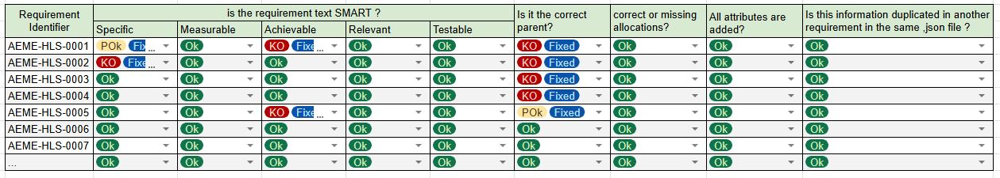
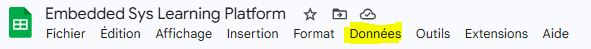
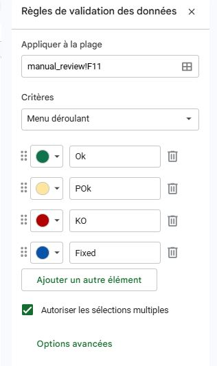

# First Task: Review the System Requirements written by Djamal

Your first task will be to review Djamal's work, the System Architect. This will involve:

- Reading the Client Specification that Djamal wrote with the client [HLS](./HLS.json).
- Reading the System Specification that Djamal wrote based on the Client Specification [SES](./SES.json).
- Making sure that each requirement is SMART (Specific, Measurable, Achievable, Relevant, Testable).
- Making sure that the requirements are properly linked (traceability) between the Client Specification and the System Specification.
  - For requirement that are not linked, ask yourself: Why? Is it because the requirement is not relevant to the system? Or is it because Djamal forgot to link it? Or is it because Djamal forgot to write the corresponding requirement in the System Specification?
- Making sure that the requirements are properly allocated to the System, Software, Hardware, or Mechanical domains.
- Making sure that the requirements are properly written in the JSON format with all the necessary attributes (identifier, title, text, verification method, parent, allocation, variant).
- Making sure that the information in the requirements is not duplicated and that there is a single source of truth for each piece of information.

Make this as a checklist for each requirement!

By creating a Excel Sheet table as a checklist:

- HLS_review.xlsx: save it next to HLS.json on your desktop,
- SES_review.xlsx: save it next to SES.json on your desktop.

For each requirement, HLS and SYS, check if it meets the criteria and write your comments if it doesn't, suggest improvements and apply them locally on the file.



To have such drop down list widget in all cells:
- Select cells,
- Go to "Data" -> "Data validation rules":



- Configure this type of format:



This is manual work that will help you:
- Understand the requirements and the design decisions made by Djamal.
- Learn how to write good requirements that are SMART and traceable.
- Learn how to use the JSON format for requirements and how to read and write JSON files.
- Learn about requirements that are gonna flowdown to the Software Unit Specification (the ones that have Software allocation).

Once you finish, add your changes and commit them! Open GitBash in the root of the folder and run the following commands:

```shell
git status
git add .
git commit -m "Task1: manual review with two xlsx file, one for HLS, one for SES."
```

**Before diving into the review here are some important concepts and best practices that you should know about requirements in the aerospace industry.**

# 1. The format of the Specification and Requirements:

In simple terms, a requirement is a contract. It defines what the system must do, without necessarily dictating how it should do it.

They describe functional, operational or performance needs (e.g., "The system shall display altitude in feet").

## Criteria 1: Requirements should be SMART

To ensure a requirement is useful and "testable," we use the SMART acronym. If a requirement isn't SMART, it shouldn't be in your document:

| Letter | Meaning      | Description                                                                    |
|--------|--------------|--------------------------------------------------------------------------------|
| S      | Specific     | It targets one specific function or behavior with no ambiguity.                |
| M      | Measurable   | You can quantify it (e.g., "within 10ms" instead of "quickly").                |
| A      | Achievable   | It is technically possible to build within the project constraints.            |
| R      | Relevant     | It provides value to the system and maps to a higher-level goal.               |
| T      | Testable     | There must be a way to prove the requirement was met via test or analysis.     |

Bad Example: "The software should be fast and never crash." (Not measurable, not specific).

Good Example: "The software shall process the sensor input within 50ms of receiving the interrupt." (SMART).

The Goal of DO-178C (Software Considerations in Airborne Systems and Equipment Certification) is the "Bible" of aviation software.

Contrary to popular belief, the goal of avionic standards like software standard DO-178C is not to prevent bugs. No process can guarantee 0% bugs. 

Instead, the goal is Safety Assurance through "Airworthiness". Documenting, testing, managing changes.

Key Objectives:
- Repeatability: Ensuring that the process used to build the software is documented and can be repeated.
- Traceability: Proving that every line of code exists because of a requirement, and every requirement has been tested.
- Deterministic Behavior: Ensuring the software behaves predictably under all flight conditions, including error states.
- Verification: Demonstrating that the software does what the requirements ask it to do, nothing more, nothing less. with a level of confidence based on its DAL (Design Assurance Level), ranging from DAL A (Catastrophic failure if it fails) to DAL E (No effect on safety).
 
In aerospace, the code is only 50% of the product. The other 50% is the evidence (the documents) that proves the code is safe.

## Criteria 2: Anatomy of a Requirement:

A requirement is more than just a sentence; it is a database entry. In tools like DOORS or Jama (or your GitHub bench), each requirement has Attributes that provide metadata.

| Attribute | Definition | Why it matters |
|-----------|-----------|-----------|
| Unique ID | A permanent identifier (e.g., SW-REQ-001). | Essential for traceability and version control. |
| Title | A short descriptive name for the requirement. | Helps in quickly identifying the requirement's purpose. |
| Text | The detailed description of what the requirement entails. | Provides the full specification of the requirement. |
| Parent Link | The ID of the higher-level requirement it satisfies. | Proves Upward Traceability (Why am I doing this?). |
| Child Link | The ID of the lower-level requirement or code block. | Proves Downward Traceability (Did I forget anything?). |
| Allocation | Which subsystem owns this? (SW, HW, or Mech). | Ensures no requirement is "homeless" or duplicated. |
| Verification Method | How we prove it works (Test, Analysis, Inspection, or Demo). | Tells the tester exactly how to write the test case. |
| Variant | The version for which the requirement applies. (current or future or obsolete) | Helps manage different versions of the same product. |

## Criteria 3: The Semantics of Requirements

In requirement writing, word choice is a legal obligation, not a stylistic preference. We use specific "modal verbs" to define the weight of a statement.

### The requirements should not describe implementation details, but rather the behavior

What the requirement should describe:

- The required behavior or characteristic of the system
- The expected result, output, or condition
- The constraints and performance needed

What it should not describe:

- internal design decisions
- algorithms, code structure, or implementation methods
- specific technology choices

Example:

- Poor requirement:
  - "The software shall use a round-robin scheduler to process sensor data."
  - This is implementation detail.

- Better requirement:
  - "The software shall process each sensor sample within 10 ms of arrival."
  - This describes behavior and is testable.

Why this matters:

- Behavior-focused requirements are easier to verify
- They leave design choices open to engineers
- They reduce duplication and avoid locking the solution too early

### The "Shall" (Mandatory)
The word "Shall" is the only word used for a binding requirement.

Semantic: "The System shall disconnect the autopilot when the pilot applies 10lbs of force to the yoke."

Meaning: If this doesn't happen 100% of the time, the system is a failure.

### The "Shall Not" (Constraints)
Used for safety-critical prohibitions.

Semantic: "The System shall not deploy the thrust reversers while the aircraft is in 'In-Air' mode."

Meaning: This is a "negative requirement" used to prevent catastrophic states.

### Non-Binding Semantics (Avoid these in Requirements!)

Should/May: Suggests a preference or optional feature. These have no place in a DO-178C requirement because they are not "verifiable."

Will: Usually reserved for "Statements of Fact" regarding the environment, not the system's behavior. (e.g., "The sun will provide ambient light during daytime operations").

## Criteria 4: Derived Requirements

Sometimes, while designing the software, you realize you need a feature that the System level didn't ask for.

Example: To meet a timing requirement, the software engineer decides to implement a "Watchdog Timer."

The Rule: This is a Derived Requirement. Because it has no "Parent" at the System level, it must be sent to the Safety Team to ensure this new functionality doesn't introduce new risks. In traceability matrix, the derived requirement will not have a parent, so they need to have a justification.

## Criteria 5: The Spirit of Traceability

Traceability isn't just a list; it's a thread. If you pull on a Test Case (Right side of V-Cycle), it should lead you to a Software Requirement, which leads to a System Requirement (Left side of V-Cycle), which eventually leads to a Pilot's need. If the thread breaks, the aircraft doesn't fly.

## Criteria 6: The single source of truth for requirements

When specifying a detail in a requirement, we should make sure that this detail is specified in **one requirement only**.

For example, if we have a requirement that specifies the data collection frequency, this requirement should be the only one that specifies this detail. If we have another requirement that needs to specify this detail, it should reference the first requirement instead of specifying it again.

```
Requirement 1: "The system shall collect data from the sensors at a frequency of 10Hz, defined as DATA_COLLECTION_FREQUENCY."
```

```
Requirement 2: "The system shall raise an error if the collected data is not processed within the defined DATA_COLLECTION_FREQUENCY."
```

You should never mention the value of the frequency in Requirement 2, instead you should reference the value defined in Requirement 1. This way, if we need to change the frequency later, we only need to change it in one place (Requirement 1) and all other requirements that reference it will automatically be updated.

# 2. Format of the Client Specification

Djamal sat down with the client and wrote the Client Specification, which outlines the client's requirements and expectations for the project. The Client Specification includes details such as the parameters that need to be monitored, the data collection frequency, and the user interface requirements.

He wrote the requirements in JSON format:

```json
[
  {
    "identifier": "AEME-HLS-0001",
    "title": "Maximum size for the equipment",
    "text": "The equipment shall not exceed maximum size of 40cm x 40cm x 20cm (length x width x height).",
    "verification_method": "Test",
    "parent": "",
    "allocation": "System",
    "variant": "current"
    },
    {
    "identifier": "AEME-HLS-0002",
    "title": "...",
    "text": "...",
    "verification_method": "...",
    "parent": "...",
    "allocation": "...",
    "variant": "..."
    }
]
```

All requirements in this project will be written in this JSON format:

- A list of dictionaries: each dictionary represents a requirement and contains the attributes of that requirement (identifier, title, text, verification method, parent, allocation, variant).

The identifiers for each requirement document should follow the format:

| Specification Document | Identifier Format |
|------------------------|--------------------|
| High Level Specification (Client Specification) | AEME-HLS-XXXX |
| System Specification | AEME-SYS-XXXX |
| Software Unit Specification | AEME-SW-XXXX |
| Hardware Unit Specification | AEME-HW-XXXX |
| Mechanical Unit Specification | AEME-MECH-XXXX |
| Hardware Software Interface Specification | AEME-HSI-XXXX |

Where XXXX is a **unique** number for each requirement.

______

**Good Luck doing this task!**