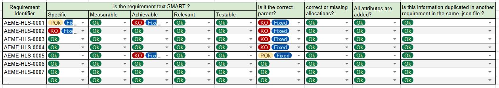
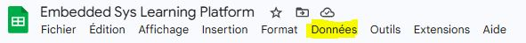
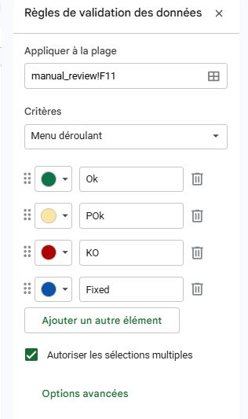

# First Task: Review the System Requirements written by Djamal

Your first task will be to review Djamal's work, the System Architect. This will involve:

- Reading the Client Requirement that Djamal wrote with the client [CR](./CR.json).
- Reading the System Specification that Djamal wrote based on the Client Requirement [SES](./SES.json).
- Making sure that each requirement is SMART (Specific, Measurable, Achievable, Relevant, Testable).
- Making sure that the requirements are properly linked (traceability) between the Client Requirement and the System Specification.
  - For requirement that are not linked, ask yourself: Why? Is it because the requirement is not relevant to the system? Or is it because Djamal forgot to link it? Or is it because Djamal forgot to write the corresponding requirement in the System Specification?
- Making sure that the requirements are properly allocated to the System, Software, Hardware, or Mechanical domains.
- Making sure that the requirements are properly written in the JSON format with all the necessary attributes (identifier, title, text, verification method, parent, allocation, variant).
- Making sure that the information in the requirements is not duplicated and that there is a single source of truth for each piece of information.

Make this as a checklist for each requirement!

By creating a Excel Sheet table as a checklist:

- CR_review.xlsx: save it next to CR.json on your desktop,
- SES_review.xlsx: save it next to SES.json on your desktop.

For each requirement, CR and SYS, check if it meets the criteria and write your comments if it doesn't, suggest improvements and apply them locally on the file.



To have such drop down list widget in all cells:
- Select cells,
- Go to "Data" -> "Data validation rules":



- Configure this type of format:



This is manual work that will help you:
- Understand the requirements and the design decisions made by Djamal.
- Learn how to write good requirements that are SMART and traceable.
- Learn how to use the JSON format for requirements and how to read and write JSON files.
- Learn about requirements that are gonna flowdown to the Software Unit Specification (the ones that have Software allocation).

Once you finish, add your changes and commit them! Open GitBash in the root of the folder and run the following commands:

```shell
git status
git add .
git commit -m "Task1: manual review with two xlsx file, one for CR, one for SES."
```

**Before diving into the review here are some important concepts and best practices that you should know about requirements in the aerospace industry.**

# 1. The format of the Specifications and Requirements:

Djamal sat down with the client and wrote the Client Requirement, which outlines the client's requirements and expectations for the project. The Client Requirement includes details such as the parameters that need to be monitored, the data collection frequency, and the user interface requirements.

He wrote the requirements in JSON format:

```json
[
  {
    "identifier": "AEME-CR-0001",
    "title": "Maximum size for the equipment",
    "text": "The equipment shall not exceed maximum size of 40cm x 40cm x 20cm (length x width x height).",
    "verification_method": "Test",
    "parent": "",
    "allocation": "System",
    "variant": "current"
    },
    {
    "identifier": "AEME-CR-0002",
    "title": "...",
    "text": "...",
    "verification_method": "...",
    "parent": "...",
    "allocation": "...",
    "variant": "..."
    }
]
```

All requirements in this project will be written in this JSON format:

- A list of dictionaries: each dictionary represents a requirement and contains the attributes of that requirement (identifier, title, text, verification method, parent, allocation, variant).

The identifiers for each requirement document should follow the format:

| Specification Document | Identifier Format |
|------------------------|--------------------|
| Client Requirements | AEME-CR-XXXX |
| System Specification | AEME-SYS-XXXX |
| Software Unit Specification | AEME-SW-XXXX |
| Hardware Unit Specification | AEME-HW-XXXX |
| Mechanical Unit Specification | AEME-MECH-XXXX |
| Hardware Software Interface Specification | AEME-HSI-XXXX |

Where XXXX is a **unique** number for each requirement.

______

**Good Luck doing this task!**