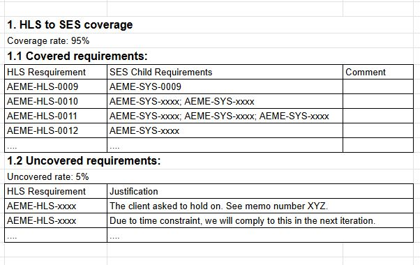
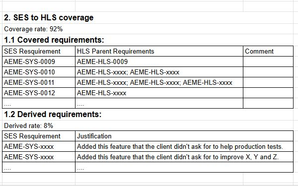

# Python Project: Automating Requirement Management and Traceability

On your own computer, create the following folder structure, create empty folders and copy the JSON files to the right places from that you have here:

```
AEME_PROJECT/
└── 99_TOOLS/
    └── Requirement_Management_and_Traceability/
        ├── requirement_sanity_checker.py
        └── traceability_matrix.py
```

Your task is to write two Python scripts:

<details>
  <summary>If you do not want to learn Python and Software:</summary>
  You can read what these script should do, and do it manually.
</details>

## 1. `requirement_sanity_checker.py`: 

This script will read the requirements from the JSON files and check them against a checklist of criteria to ensure they are well-written.

This script shall take as input:
- first, the relative path to the JSON file containing the requirements,
- second, the requirement identifier root (like "AEME-SYS-")
- third optional, the parents possible requirement identifiers as a coma separated string, for example "AEME-HLS-" or "AEME-SYS-,AEME-HSI-".

The script shall perform the following checks:

- Criteria 1: The JSON file is readable, no error in the format.
  - This is verified by importing the JSON library and reading the file int a list of dictionaries.
    - If there is an error in the format, the script shall print in red a message indicating the error and the file that contains it.
    - If the file is readable, the script shall print in green a message indicating that the file is valid.
- Criteria 2: Each requirement has the necessary attributes (see attribute list in [first task](./_task_1.md)).
  - This is verified by checking if each dictionary in the list of dictionaries has all the necessary keys.
    - If a requirement is missing an attribute, the script shall print in red a message indicating which attribute is missing and the identifier of the requirement.
    - If all requirements have the necessary attributes, the script shall print in green a message indicating that all requirements are valid.
-Criteria 3: Each requirement has a unique identifier that follows the root defined as the input to the script .
  - This is verified by creating a list of identifiers and checking if there are any duplicates and checking that each one of them follows the root + 4 digits number.
    - If there are duplicate identifiers, the script shall print in red a message indicating which identifiers are duplicated and the file that contains them.
    - If all identifiers are unique, the script shall print in green a message indicating that all identifiers are unique.
- Criteria 4: For attribute with a predefined set of values (e.g., "Verification Method", "Variant", "Allocation"), the value is valid.
  - This is verified by checking if the value of the attribute is in the predefined set of values.
    - If there is an invalid value, the script shall print in red a message indicating which attribute has an invalid value, what the invalid value is, and the identifier of the requirement.
    - If all values are valid, the script shall print in green a message indicating that all values are valid.
- Criteria 5: For the text of the requirement, it should not be empty and should not contain any of the following words: "should", "may", "might", "can", "will", "must".
  - This is verified by checking if the text of the requirement is empty or contains any of the forbidden words.
    - If there is an issue with the text, the script shall print in red a message indicating what the issue is and the identifier of the requirement.
    - If all texts are valid, the script shall print in green a message indicating that all texts are valid.
- Criteria 6: For the title of requirement, it should not be empty and should be concise (less than 10 words).
  - This is verified by checking if the title of the requirement is empty or has more than 10 words.
    - If there is an issue with the title, the script shall print in red a message indicating what the issue is and the identifier of the requirement.
    - If all titles are valid, the script shall print in green a message indicating that all titles are valid.
- Criteria 7: For the "parent" field of all requirements, if not empty:
  -  make sure that if it a list of many parents, the list is separated by ';' and not ','. 
  -  make sure for each parent, its root is one of the mentioned as the input to the requirement + 4 digits number , not another unmentioned root.

The script shall return zero if all checks are passed, and a non-zero value if there is at least one issue with the requirements.

The script shall print these as a report in the terminal, and also save the report in a text file in the same folder as the input JSON file, with the same name but with a "\<input file name\>_sanity_check.txt" extension.

The python script shall be well-documented with comments explaining the logic of the code and the purpose of each function.

The python script shall undergo flake8 check to ensure it follows the PEP 8 style guide.

```
pip install flake8  # for installing flake8 if you don't have it already
flake8 requirement_sanity_checker.py
```

The python script shall pass mypy type checking to ensure that the code is type-safe.

```
pip install mypy  # for installing mypy if you don't have it already
mypy --disallow-untyped-defs requirement_sanity_checker.py
```

The python script shall be tested with different JSON files to ensure it works correctly and handles different cases (e.g., valid requirements, missing attributes, duplicate identifiers, invalid values, issues with text and title).

The script shall be used like this:
```
python requirement_sanity_checker.py ../../01_SYSTEM/01_Development_phase/SES.json "AEME-SYS-" "AEME-HLS-"
```


## 2. `traceability_matrix.py`:

This script will generate a traceability matrix that shows the relationships between System Requirements, Software Requirements, and Test Cases.

This script shall take as input:
 - first, the relative path to the JSON file containing the Upper-level requirements (e.g., System Requirements),
 - second, the relative path to the JSON file containing the Lower-level requirements (e.g., Software Requirements or Hardware Requirements...).

The script shall transform the requirements into two lists of dictionaries, upper_level_requirements and lower_level_requirements.

### 2.1 Upper to lower requirement traceability

The script shall create a csv file named "upper_to_lower_requirement_traceability.csv" with the following header:

```
upper requirement,lower requirements,justification of needed
```

The script shall, for each upper level requirement, search for its identifier in the lower level requirement list as the "parent" field.

For each upper requirement, the script shall add a row with this format:

```
<upper req identifier>,<lower req identifier>;<upper req identifier>;...,<empty justification>
```

The script shall make the justification empty if there is at least one lower requirement for the upper requirement.

The script shall put as a justification "NO CHILDREN! MUST JUSTIFY" so that the user manually edits the csv file.

The script shall calculate and print the percentage of covered requirements calculated as:
$$ \text{Coverage percentage} = \frac{\text{number of upper requirements that have children}}{\text{number of upper requirements}} $$

### 2.2 Lower to Upper requirement traceability

The script shall create a csv file named "lower_to_upper_requirement_traceability.csv" with the following header:

```
upper requirement,lower requirements,justification of needed
```

The script shall, for each lower level requirement, get the identifiers of its parents in the "parent" field of said lower level requirement.

For each lower requirement, the script shall add a row with this format:

```
<lower req identifier>,<upper req identifier>;<upper req identifier>;...,<empty justification>
```

The script shall make the justification empty if there is at least one upper requirement for the lower requirement.

The script shall put as a justification "NO PARENTS! MUST JUSTIFY" so that the user manually edits the csv file.

The script shall calculate and print the percentage of covered requirements calculated as:
$$ \text{Coverage percentage} = \frac{\text{number of lower requirements that have parents}}{\text{number of lower requirements}} $$

Just like the previous script, this script shall undergo flake8 and mypy verifications.

The script shall be used like this:

```
python traceability_matrix.py ../../00_Product/HLS.json ../../01_SYSTEM/01_Development_phase/SES.json
```

## 3. Run both scripts on SES and HLS

Run the sanity check on both SES and HLS with the correct parameters. Change anything that needs to be changed in these files.

Run the traceability matrix script to get the "cross traceability".

With the resulted .csv file, create an Excel sheet or Doc with the following chapters and sub chapters:

1. HLS to SES matrix
   1. Covered requirements
   2. Uncovered requirements (with justification for each requirement)
2. SES to HLS matrix
   1. Covered requirements
   2. Derived requirements (uncovered requirement, with justification for each requirement)


The document should look like this:





Put this document in the System Development folder, next to the SES.json
