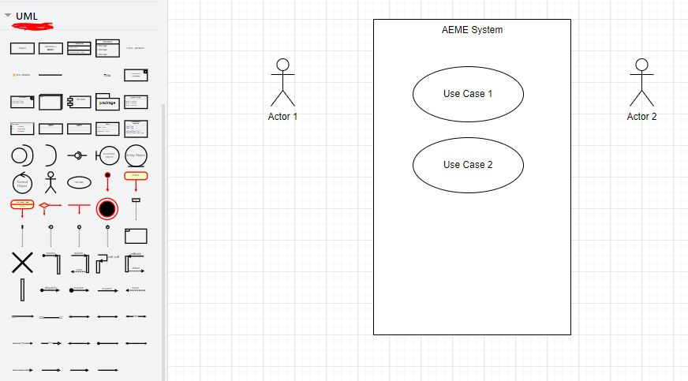
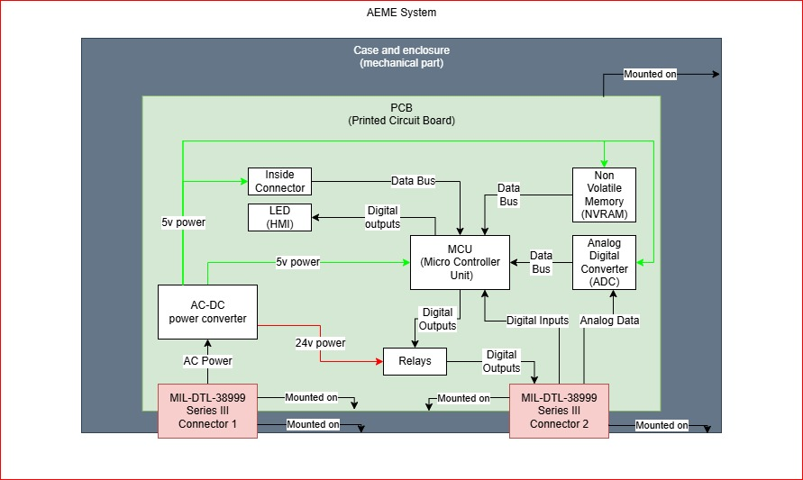
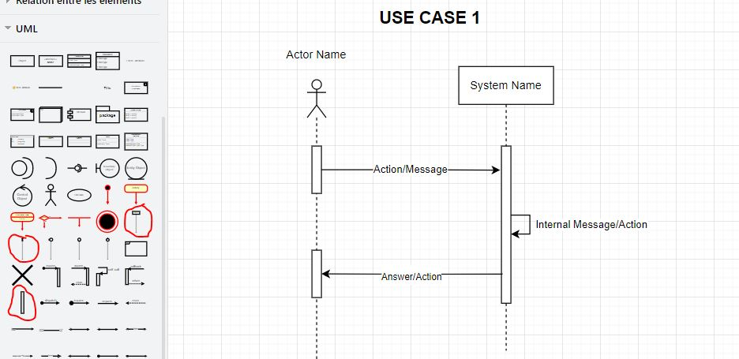

# System Diagrams

Help the system engineer draw the following diagrams:

1. Use Case Diagram,
2. Functional Blocks Diagram,
3. Physical Blocks Diagram,
4. State Diagram,
5. Sequence Diagram (for each use case).

Let's use [Draw.io](https://www.drawio.com/) desktop tool to create these diagrams.

Create one Draw.io file, save it in the "System/Implementation" directory.

In this Draw.io file, each diagram will be drawn on one page.

I hope you did watch and learned from the suggested [prerequisites knowledge](../../01_prerequisites_knowledge/README.md).

If you feel confident enough, go and do it alone! then compare it to my suggestion below.

If you need more tips and hints on each one of these diagrams, you will get them in the next subchapters.

## 1. Use Case Diagram,

  
Tip 1!

  On the left bar of Drawio, find the UML section of shapes. Use the following shapes to draw the use case diagram.

  

  
Hint: Who are the actors?!

  The default actors that are usually always present are:

1. Maintenance Guy: Name him however you want, your system will always need a maintenance guy! He is usually the "customer service" guy from your company (service après vente).
2. Configuration Guy: The client that will buy and use your system, will need to configure it at the first time and many other times later. He is a member of the client company.
3. User: if the system is used by a direct user (like an ATM machine, distributeur de billet).

  
Hint: Do we have a User?!

  The user in our case is the guy who enables/disables monitoring. Wether it is a human (pilot or mechanic) or another system that controls our.

  
Hint: What are our use cases?!

  The default use cases are:

1. The configuration use case, (on the table of the client, getting tuned to their case by the configuration actor)
2. The maintenance use case, (on the table of reparation in our company, getting fixed by the maintenance guy)
3. The operational use case. (mounted onboard and powered on.)
4. We may need a use case for the production, to give the guy who work on the production line more access or more features to help assemble / test / do stuff that is needed only in production line. Let you decide wether we need it, I'd say the maintenance use case will be enough for production line.

  
My suggestion for Use Case Diagram!

  Too lazy to do one, just link the right actors with the right use cases... And do not forget to connect use cases with "include" and "extends" arrows if needed.

## 2. Functional Blocks Diagram,

  
Tip 1!

  Think of this diagram as "what does he system do?".

- The system is a big square, inside of it we put the functionalities,
- Each functionality is a square with its name in the square.
- Sub-functionalities should be inside the square of main functionalities.
- Inputs and outputs of functionalities are shown in thick arrows.

  
Hint: What are the functionalities?!

- Monitoring.
- Reading Analog inputs.
- Reading the Digital Input (standby pin).
- Updating system data on NVRAM (power cycles, uptime minutes counters).
- Reading UART CLI buffer.
- Updating system data from CLI commands.
- Commanding the digital output to shutdown the engine.
- ...

## 3. Physical Blocks Diagram,

  
Tip 1!

  Think of this diagram as "what are the physical blocks of the system?".

  
Tip 2!

- The system is a big square,
- Each physical block is a square inside the system,
- Each square will be linked with arrows to the other physical blocks they interact with,
- Sub blocks are drawn inside of main blocks.

  
Hint: what are the physical blocks?!

- Case and enclosure (mechanical part),
- Outside connectors,
- Inside connector,
- AC-DC power converter,
- MCU (Micro Controller Unit),
- Analog-Digital-Converter (ADC for analog inputs),
- Non-Volatile-Memory (NVRAM),
- Relays (to control digital outputs),
- LEDs (Human Machine Interface),
- PCB (Printed Circuit Board).

  
My suggestion

## 4. State Diagram,

  
Hint: what are the states?!

  Should be something like

- Off.
- Init.
- Maintenance (CLI answering through UART).
- Standby.
- Monitoring.

  
Hint: when to transition between state?!

  Should be something like

- Off <-> Init: when the power is enabled.
- Init <-> Maintenance: when we receive a message through UART.
- Init <-> Standby: when we do not receive a message through UART.
- Standby <-> Monitoring: when the dedicated standby pin is switched.
- Monitoring <-> Standby: when the dedicated standby pin is switched back.

## 5. Sequence Diagram (for each use case).

  
Tip 1!

  On the left bar of Drawio, find the UML section of shapes. Use the following shapes to draw the sequence diagram.

  

  
Hint

  For each use case in the USE_CASE_DIAGRAM, you should draw a sequence diagram of the different interactions between each Actor and System.

  Note that the vertical axis represents time passing from up to bottom.

