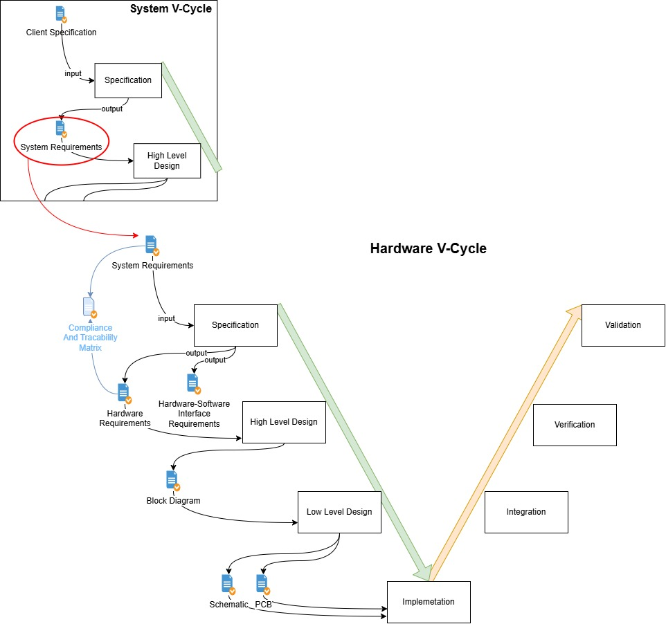

# Helping Aziz with his Hardware tasks

In this chapter, we will be helping Aziz with his hardware tasks.

Hardware is a "Unit" of the "System" that is responsible for the electrical and electronic components.

Just like the "System", the development process of the "Hardware" unit will follow a V-Cycle.

Here is the overview of the V-Cycle for the "Hardware" unit and how it is related to the "System":

As you can see, the Hardware V-Cycle comes after the System V-Cycle, at least once we have the System requirements and the System Block Diagram defined, we can start working on the Hardware unit.

So, what we need to do to help Aziz is:

1. Write the Hardware-Software Interface requirements (HSI.json). [Task 1](./_task_1.md).
2. Optional: Write the Hardware requirements (HRD.json) & its traceability matrix. [Task 2](./_task_2.md).
3. Optional: Draw the Hardware Block Diagram (hardware_block_diagram.io drawio diagram). [Task 3](./_task_3.md).
4. Optional: Draw the Schematics (Eagle or KiCad).
5. Optional: Draw the PCB layout (Eagle or KiCad).

## Aziz's General Idea:

Aziz's general idea is to:

- Use STM32 G071RB as the microcontroller for the hardware unit.
- Use ADS1015 12-BIT ADC (analog digital converter) to read the sensors data.
- Use SPI FRAM 64KBIT MB85RS64 as NVRram (non-volatile random-access memory) to store critical data, log, and other information.

Here is the draft schematic that Aziz has drawn:

